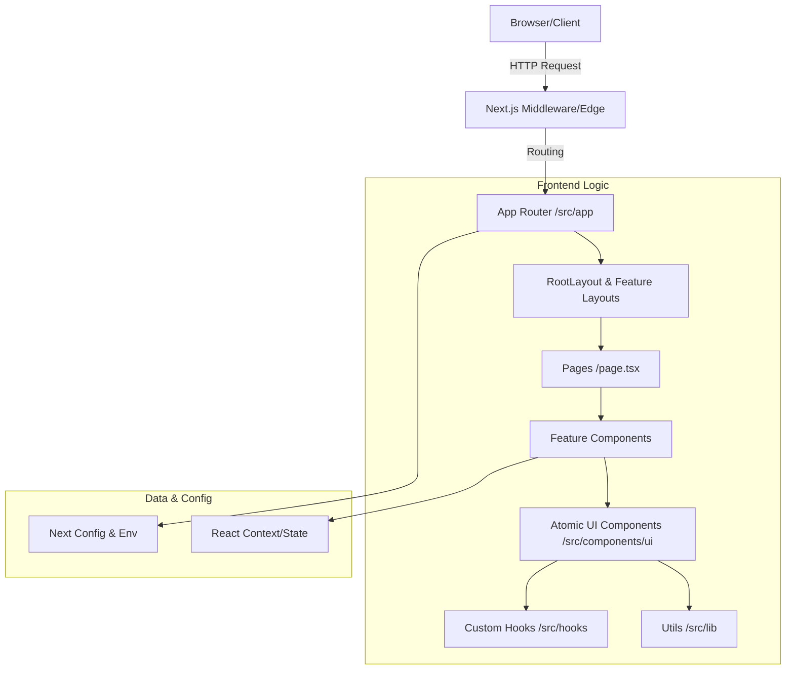

# Architecture Overview

This document describes the high-level architecture, design patterns, and technical decisions for the **Máquina de Conteúdo** repository.

## System Topology
The application is a **Monolithic Frontend** built with Next.js (App Router), deployed as a server-rendered application. It relies on a component-driven architecture for UI and utilizes TypeScript for type safety across the stack.

### High-Level Diagram


## Technology Stack

| Layer | Technology | Purpose |
|-------|------------|---------|
| **Core Framework** | [Next.js 14+](https://nextjs.org/) | App Router, SSR/CSR, Routing |
| **Language** | [TypeScript](https://www.typescriptlang.org/) | Static typing and interfaces |
| **Styling** | [Tailwind CSS](https://tailwindcss.com/) | Utility-first CSS |
| **UI Library** | [Shadcn UI](https://ui.shadcn.com/) / Radix UI | Headless accessible components |
| **Icons** | Lucide React | Iconography |
| **Package Manager** | Npm/Node | Dependency management |

## Directory Structure & Modules

The project follows the standard Next.js App Router structure with a focus on feature encapsulation.

```
/src
├── /app             # Application routes and layouts
│   ├── /styleguide  # Internal documentation maps/routes
│   ├── globals.css  # Global styles and Tailwind directives
│   └── layout.tsx   # Root layout (Html/Body wrappers)
├── /components      # React components
│   └── /ui          # Atomic, reusable UI primitives (Shadcn)
├── /hooks           # Custom React hooks (e.g., use-mobile)
└── /lib             # Shared utilities and helper functions
```

### Key Modules

#### 1. App Router (`src/app`)
*   **Entry Point**: `RootLayout` in `src/app/layout.tsx` handles the global shell, font injection, and metadata.
*   **Styleguide**: A dedicated section (`src/app/styleguide`) serves as an internal playground or design system documentation, utilizing `navigation.ts` for structure.

#### 2. UI Components (`src/components/ui`)
This directory contains atomic design elements. The project relies heavily on **Shadcn UI**, where components are owned source code rather than NPM dependencies.
*   **Pattern**: Components export named primitives (e.g., `Sheet`, `SheetTrigger`, `SheetContent`).
*   **Styling**: Uses clsx/tailwind-merge via the `cn()` utility for class overrides.
*   **Specialty Components**: Includes specialized UI like `TubelightNavbar` and `Spinner` alongside standard primitives.

#### 3. Utilities (`src/lib`)
*   **`utils.ts`**: Contains the canonical `cn` function used across virtually every component to safely merge Tailwind classes.

## Design Patterns & Decisions

### 1. Composition over Inheritance
The UI architecture relies on composition. For example, the `Dialog` component allows arbitrary content injection via `DialogContent` rather than prop-heavy configuration.

```tsx
// Pattern used in src/components/ui/dialog.tsx
<Dialog>
  <DialogTrigger>Open</DialogTrigger>
  <DialogContent>
    <DialogHeader>...</DialogHeader>
    {/* Composition allows flexibility here */}
  </DialogContent>
</Dialog>
```

### 2. Client vs. Server Components
*   **Default**: Next.js App Router creates Server Components by default.
*   **Client Boundaries**: Files containing interactive logic (hooks, event listeners) are marked with `"use client"`.
    *   *Example*: `src/components/ui/sidebar.tsx` and `src/hooks/use-mobile.ts` imply client-side interactivity.

### 3. Responsive Design Strategy
*   **CSS**: Tailwind's prefix modifiers (`md:`, `lg:`) are the primary method for responsiveness.
*   **Logic**: The `useIsMobile` hook (`src/hooks/use-mobile.ts`) provides programmatic access to viewport state for conditional rendering logic that CSS cannot handle alone (e.g., changing event handlers or drastic layout shifts).

## Data Flow & State Management

*   **Local State**: `useState` and `useReducer` for component-level interaction (e.g., opening menus, toggling inputs).
*   **Context API**: Used for global UI state, such as Sidebar visibility or Theme providers.
    *   *Evidence*: `SidebarContextProps` in `src/components/ui/sidebar.tsx`.

## Key Files & Exports

| Component | Location | Description |
|-----------|----------|-------------|
| `cn` | `src/lib/utils.ts` | **Critical**. CSS class merger utility. |
| `RootLayout` | `src/app/layout.tsx` | Main HTML wrapper. App entry point. |
| `useIsMobile` | `src/hooks/use-mobile.ts` | Device detection hook. |
| `TubelightNavbar` | `src/components/ui/tubelight-navbar.tsx` | Custom navigation component. |
| `NavItem` | `src/app/styleguide/navigation.ts` | Interface for menu structures. |

## Future Considerations
*   **ORM Layer**: Existence of `drizzle/` folder implies Drizzle ORM is/will be used for database interaction, though explicit symbols were not analyzed in this pass.
*   **Testing**: No explicit test setup (Jest/Vitest) was detected in the file scan, though `styleguide` serves as visual testing.

---
*Generated based on codebase analysis as of Jan 14, 2026.*
