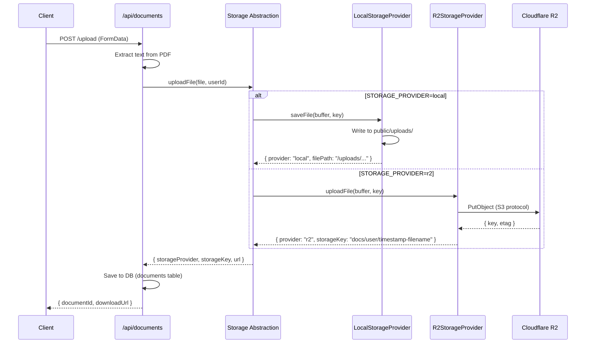
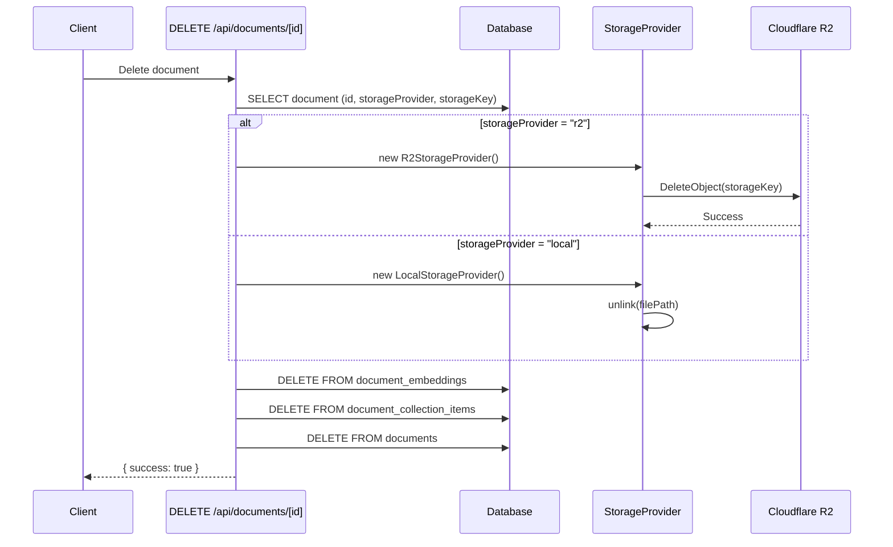
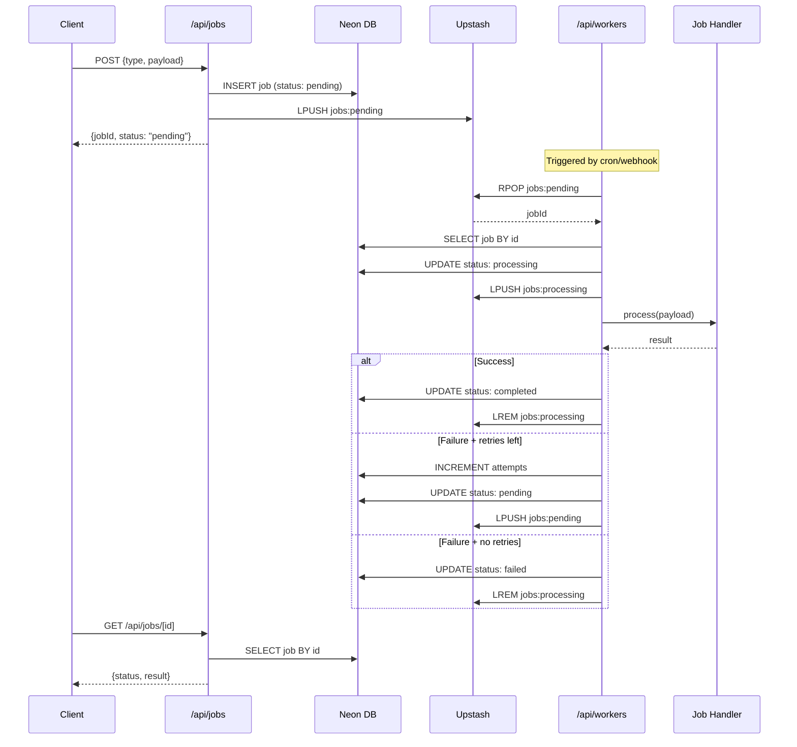
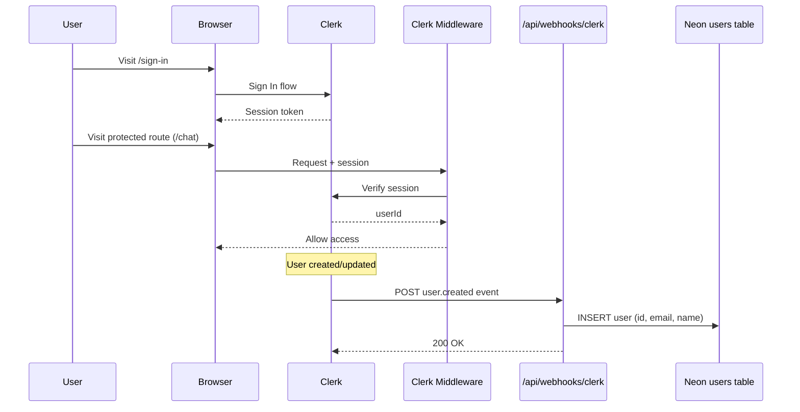
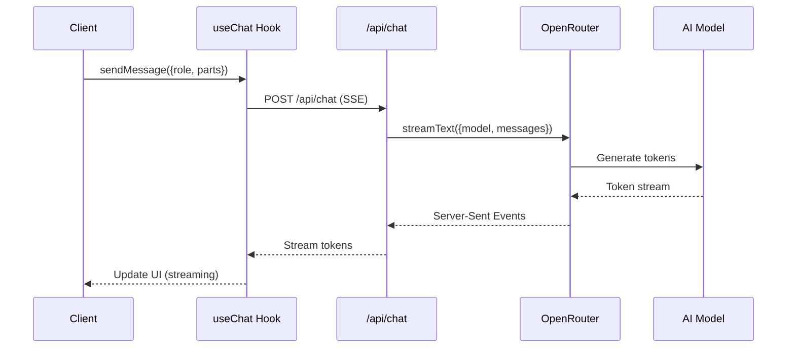
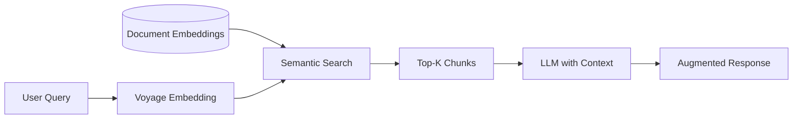
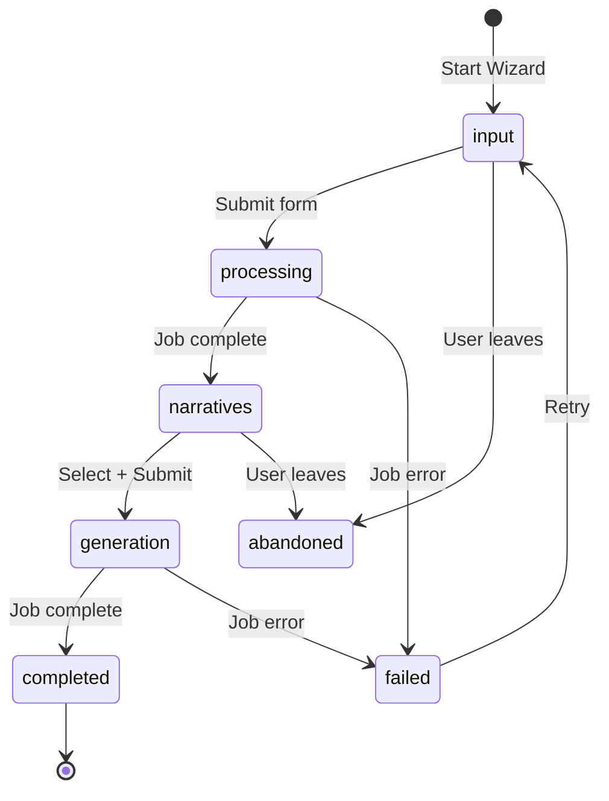
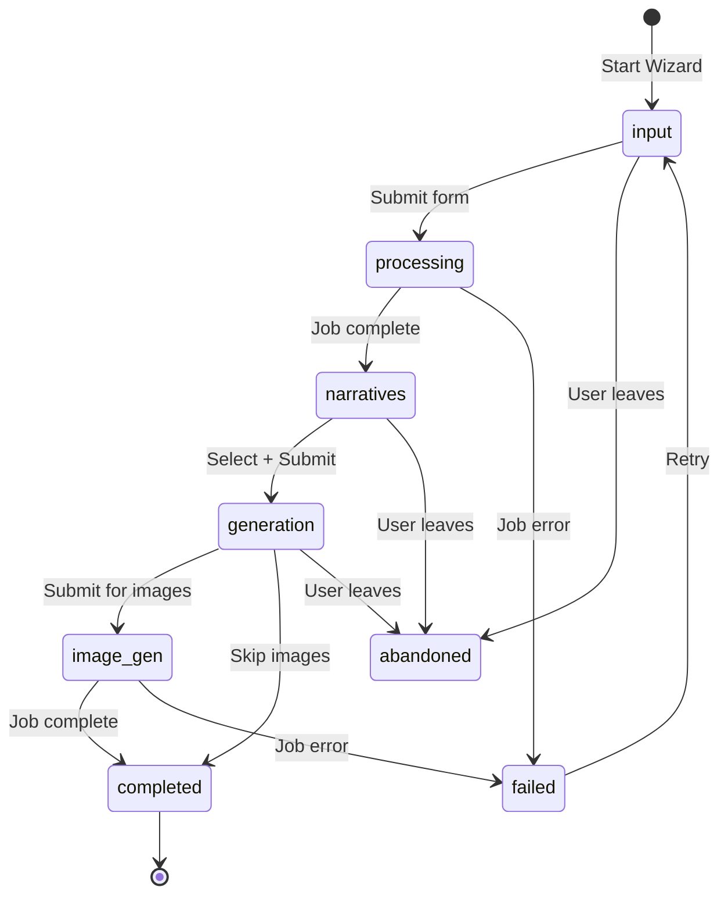
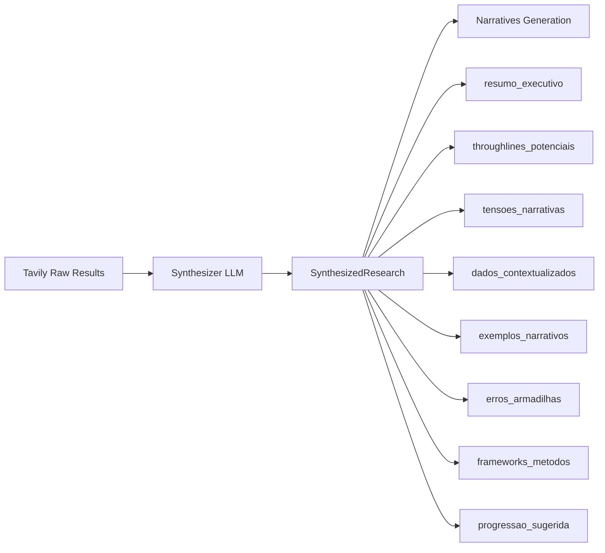
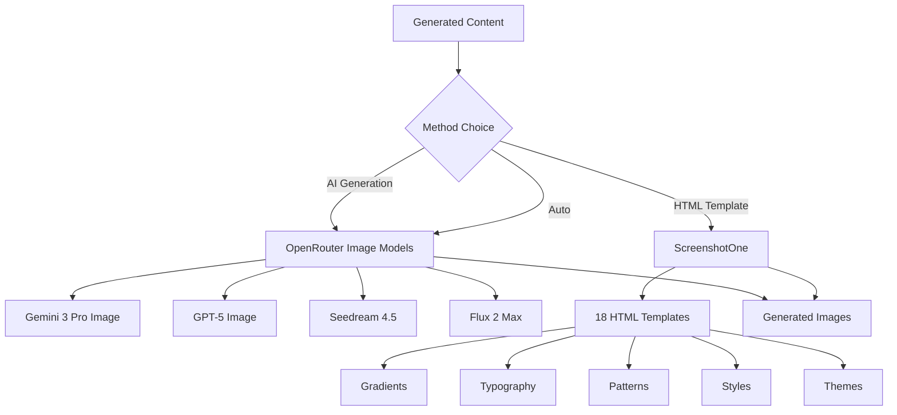

# Architecture Overview

This document describes the high-level architecture, design patterns, and technical decisions for the **Máquina de Conteúdo** repository.

## System Topology

The application is an **AI-Powered Content Studio** built with Next.js (App Router), featuring authentication, background job processing, and a PostgreSQL database. It follows a serverless-first architecture optimized for deployment on platforms like Vercel.

### High-Level Diagram

```mermaid
graph TD
    User[Browser/Client] -->|HTTP Request| Edge[Clerk Middleware]
    Edge -->|Protected Routes| App[Next.js App Router]
    Edge -->|Public Routes| App

    App -->|Auth| Clerk[Clerk Authentication]
    App -->|Webhooks| Webhook[/api/webhooks/clerk]

    subgraph Frontend Logic
        App --> Layouts[RootLayout + ClerkProvider]
        Layouts --> Pages[Sign In / Sign Up / Protected Routes]
        Pages --> Components[UI Components]
        Components --> UI[shadcn/ui Components]
    end

    subgraph Backend Services
        App --> DB[Neon PostgreSQL]
        App --> Queue[Upstash Redis Queue]
        App --> Workers[/api/workers Processor]
    end

    subgraph Storage Layer
        App --> Storage[Storage Abstraction]
        Storage --> Local[LocalStorageProvider]
        Storage --> R2[R2StorageProvider]
        R2 --> CloudR2[Cloudflare R2]
        R2 --> CustomDomain[storage-mc.zoryon.org]
    end

    subgraph External Integrations
        Workers --> APIs[OpenRouter / Firecrawl / Social APIs]
    end
```

## Technology Stack

| Layer | Technology | Version | Purpose |
|-------|------------|---------|---------|
| **Core Framework** | Next.js | 16.1.1 | App Router, SSR/CSR, Routing |
| **Language** | TypeScript | 5.x | Static typing and interfaces |
| **Styling** | Tailwind CSS | 4.x | Utility-first CSS |
| **UI Library** | Radix UI | - | Headless accessible components |
| **Authentication** | Clerk | 6.36.7 | User auth and session management |
| **Database** | Neon PostgreSQL | 17 | Serverless PostgreSQL |
| **ORM** | Drizzle ORM | 0.45.x | Type-safe database queries |
| **Queue** | Upstash Redis | 1.36.x | Background job processing |
| **Storage** | Cloudflare R2 | - | S3-compatible object storage |
| **Storage SDK** | AWS SDK v3 | 3.x | S3 client for R2 operations |
| **AI SDK** | Vercel AI SDK | 1.x | LLM streaming + hooks |
| **LLM Provider** | OpenRouter | - | Multi-model aggregation |
| **Embeddings** | Voyage AI | - | RAG embeddings (1024-dim) |
| **Icons** | Lucide React | - | Iconography |
| **Animation** | Framer Motion, GSAP | - | Declarative animations |

## Directory Structure

```
/src
├── /app                    # Next.js App Router
│   ├── /api                # API Routes
│   │   ├── /jobs           # Job management (CRUD)
│   │   ├── /jobs/[id]      # Job status endpoint
│   │   ├── /workers        # Queue processor
│   │   ├── /webhooks       # Clerk webhook sync
│   │   ├── /wizard         # Wizard de Criação (CRUD + submit)
│   │   │   ├── route.ts    # GET (list), POST (create)
│   │   │   └── /[id]       # GET, PATCH, DELETE, /submit
│   │   ├── /documents      # Document management
│   │   │   ├── /upload      # PDF/TXT/MD upload with text extraction
│   │   │   └── /[id]        # Download document from storage
│   │   └── /admin          # Admin operations
│   │       └── /clear-documents # Bulk delete all user documents
│   ├── /sign-in            # Clerk sign-in page
│   ├── /sign-up            # Clerk sign-up page
│   ├── /styleguide         # Design system documentation
│   ├── layout.tsx          # Root layout + ClerkProvider
│   └── globals.css         # Global styles + design tokens
│
├── /components             # React components
│   └── /ui                 # shadcn/ui components (30+ components)
│
├── /db                     # Database layer
│   ├── index.ts            # Neon connection (HTTP adapter)
│   └── schema.ts           # Drizzle schema (10+ tables)
│
├── /lib                    # Utilities
│   ├── utils.ts            # cn() + helpers
│   ├── /ai                 # Vercel AI SDK config
│   │   └── config.ts       # openrouter client, models
│   ├── /voyage             # Voyage AI embeddings
│   │   ├── index.ts        # client with env + DB fallback
│   │   └── embeddings.ts   # generateEmbedding()
│   ├── /rag                # RAG utilities
│   │   ├── index.ts        # types, constants (client-safe)
│   │   ├── assembler.ts    # assembleRagContext() (server-only)
│   │   └── filters.ts      # relevance filters
│   ├── /storage            # Storage abstraction layer ⭐
│   │   ├── types.ts        # StorageProvider enum, interfaces
│   │   ├── config.ts       # R2 credentials, getR2PublicUrl()
│   │   ├── /providers      # Storage implementations
│   │   │   ├── local.ts    # LocalStorageProvider (filesystem)
│   │   │   └── r2.ts       # R2StorageProvider (S3 client)
│   │   └── /utils          # Storage helpers
│   │       └── file-url.ts # getDocumentUrl(), hasStorageLocation()
│   └── /queue              # Queue system
│       ├── types.ts        # JobType, JobStatus enums
│       ├── client.ts       # Upstash Redis client
│       └── jobs.ts         # Job CRUD functions
│
├── /hooks                  # Custom React hooks
│   └── use-mobile.ts       # useIsMobile() hook
│
└── middleware.ts           # Clerk route protection
```

## Database Schema

### 10+ Tables


### Table Purposes

| Table | Purpose | Key Fields |
|-------|---------|------------|
| `users` | Clerk sync | id (Clerk), email, deletedAt |
| `chats` | AI conversations | userId, title, model |
| `messages` | Chat messages | chatId, role, content |
| `library_items` | Content library | type, status, content (JSONB) |
| `content_wizards` | Wizard de Criação state | currentStep, narratives (JSONB), generatedContent (JSONB) |
| `documents` | Knowledge base | title, content, fileType, category, storageProvider, storageKey |
| `document_collections` | Document folders | name, description, userId |
| `document_collection_items` | Many-to-many junction | collectionId, documentId |
| `document_embeddings` | RAG embeddings | documentId, embedding (JSONB), chunkIndex |
| `sources` | Scraping sources | url, type, config (JSONB) |
| `scheduled_posts` | Publishing queue | platform, scheduledFor, status |
| `jobs` | Background jobs | type, status, payload, attempts |

## Storage Architecture

### Overview

The application uses a **storage abstraction layer** that supports multiple providers:
- **LocalStorageProvider**: Filesystem-based storage for development
- **R2StorageProvider**: Cloudflare R2 for production (S3-compatible)

This design allows seamless switching between providers via environment variable configuration.

### Storage Flow



### Provider Configuration

**Environment Variables:**
```env
STORAGE_PROVIDER=local|r2

# R2 Configuration (required when STORAGE_PROVIDER=r2)
R2_ACCOUNT_ID=11feaa2d9e21cd5a972bccfcb8d1e3d7
R2_ACCESS_KEY_ID=xxx
R2_SECRET_ACCESS_KEY=xxx
R2_BUCKET_NAME=maquina-de-conteudo
R2_CUSTOM_DOMAIN=storage-mc.zoryon.org
R2_ENDPOINT=https://<account-id>.r2.cloudflarestorage.com
```

### Storage Key Pattern

**R2 Storage Keys:** `documents/{userId}/{timestamp}-{sanitizedFilename}`

Example: `documents/user_abc123/1234567890-my-document.pdf`

**Local File Paths:** `/uploads/documents/{userId}/{timestamp}-{sanitizedFilename}`

### Public URL Generation

```typescript
// R2 with custom domain
https://storage-mc.zoryon.org/documents/user_abc123/1234567890-my-document.pdf

// R2 with public URL (fallback)
https://pub-xxx.r2.dev/maquina-conteudo/documents/user_abc123/...

// Local (development)
http://localhost:3000/uploads/documents/user_abc123/...
```

### Storage Interface

```typescript
interface StorageProvider {
  uploadFile(buffer: Buffer, key: string): Promise<StorageResult>
  deleteFile(key: string): Promise<void>
  getFileUrl(key: string): string
  batchDelete(keys: string[]): Promise<BatchResult>
}

interface StorageResult {
  provider: "local" | "r2"
  storageKey: string
  url: string
}
```

### CORS Configuration

R2 bucket CORS allows public read access from:

| Origin | Purpose |
|--------|---------|
| `http://localhost:3000` | Local development |
| `https://maquina-de-conteudo.vercel.app` | Production app |
| `https://storage-mc.zoryon.org` | Custom domain |
| `https://*.zoryon.org` | Wildcard subdomains |

**Allowed Methods:** `GET`, `HEAD`

### Document Deletion Flow



### Admin Operations

**Bulk Delete Endpoint:** `DELETE /api/admin/clear-documents`

Deletes ALL user documents including:
1. Storage files (R2 + local)
2. Embeddings
3. Collection associations
4. Document records

**Response:**
```json
{
  "success": true,
  "deleted": {
    "documents": 42,
    "files": 42,
    "embeddings": 42,
    "collectionItems": 15
  },
  "steps": ["Fetching documents...", "✓ Deleted 42 R2 files", "..."]
}
```

## Queue System Architecture

### Job Processing Flow



### Job Types

| Type | Description | Handler Status |
|------|-------------|-----------------|
| `ai_text_generation` | Generate text with AI | 🔄 Mock |
| `ai_image_generation` | Generate images with AI | 🔄 Mock |
| `carousel_creation` | Create social carousels | 🔄 Mock |
| `scheduled_publish` | Publish to social media | 🔄 Mock |
| `web_scraping` | Scrape web content | 🔄 Mock |
| `document_embedding` | Generate embeddings for RAG | ⭐ Ready |
| `wizard_narratives` | Generate narrative options for Wizard | ⭐ Implemented (Jan 2026) |
| `wizard_generation` | Generate final content from Wizard | ⭐ Implemented (Jan 2026) |
| `wizard_image_gen` | Generate images for Wizard slides | ⭐ Implemented (Jan 2026) |

### Worker Triggering: Development vs Production

**CRITICAL:** Vercel Cron (`vercel.json`) only works in production deployment. Development requires manual triggering.

| Environment | Trigger Method | Implementation |
|-------------|----------------|----------------|
| **Development** | Manual via `triggerWorker()` | Called after job creation |
| **Production** | Vercel Cron | Every minute via `vercel.json` |

```typescript
// Auto-trigger pattern in development
import { triggerWorker } from "@/lib/queue/client";

function isDevelopment(): boolean {
  return process.env.NODE_ENV === "development";
}

// After creating a job
if (isDevelopment()) {
  triggerWorker().catch((err) => {
    console.error("Failed to trigger worker in development:", err);
  });
}
```

**Worker Authentication:** The `/api/workers` endpoint bypasses Clerk auth and uses `WORKER_SECRET` instead (configured in `src/proxy.ts`).

## Authentication Flow

### Clerk Integration



### Protected Routes

- **Protected:** `/chat`, `/library`, `/calendar`, `/sources`, `/settings`
- **Public:** `/`, `/sign-in`, `/sign-up`, `/api/webhooks`

## AI/LLM Integration

### Architecture (Vercel AI SDK + OpenRouter)



### Environment Variables (System-Controlled)

| Variable | Required | Purpose |
|----------|----------|---------|
| `OPENROUTER_API_KEY` | ✅ Yes | LLM access via Vercel AI SDK |
| `VOYAGE_API_KEY` | ✅ Yes | Embeddings for RAG |
| `FIRECRAWL_API_KEY` | ⬜ No | Web scraping |
| `TAVILY_API_KEY` | ⬜ No | Real-time search |

**Note:** API keys are now system-controlled (environment variables) rather than user-controlled (database-encrypted). This was changed in January 2026 for a B2B model where the company provides AI services.

### Available Models

**Text Models (12):**
- OpenAI: gpt-5-mini, gpt-5.1, gpt-5.2, gpt-4.1, gpt-4.1-mini
- Anthropic: claude-sonnet-4.5, claude-opus-4.5, claude-haiku-4.5
- Google: gemini-3-flash-preview, gemini-3-pro-preview
- xAI: grok-4.1-fast, grok-4

**Image Models (4):**
- google/gemini-3-pro-image-preview
- openai/gpt-5-image
- bytedance-seed/seedream-4.5
- black-forest-labs/flux.2-max

### RAG (Retrieval Augmented Generation)



**Voyage AI Config:**
- Model: `voyage-4-large`
- Dimensions: 1024
- Chunk Size: **Category-specific** (800-1300 tokens)
- Overlap: 100-200 tokens (varies by category)
- Similarity Threshold: 0.5 (unified)

**Category-Specific Chunking:**
| Category | Chunk Size | Overlap | Use Case |
|----------|------------|---------|----------|
| `products` | 800 | 100 | Product catalog |
| `offers` | 900 | 150 | Promotions, discounts |
| `brand` | 1300 | 200 | Voice, values, mission |
| `audience` | 1000 | 150 | Personas, demographics |
| `competitors` | 900 | 150 | Competitive analysis |
| `content` | 1200 | 180 | Posts, calendars |
| `general` | 1000 | 150 | Default balanced |

### useChat Streaming Patterns

**Client Component Pattern:**
```typescript
import { useChat } from "@ai-sdk/react"
import { DefaultChatTransport } from "ai"

const { messages, status, error, sendMessage, stop } = useChat({
  transport: new DefaultChatTransport({
    api: "/api/chat",
    body: {
      agent: "zory",
      model: "gpt-5-mini",
      categories: ["brand", "products"],
      useRag: true,
    },
  }),
  onFinish: ({ message }) => {
    const text = getMessageText(message)
    onComplete?.(text)
  },
})

// Send message with SDK v3 format
sendMessage(
  { parts: [{ type: "text", text: messageToSend }] },
  { body: { agent, model, categories, useRag } }
)
```

**Message Format (SDK v3 UIMessage):**
```typescript
interface UIMessage {
  id: string
  role: "user" | "assistant" | "system"
  parts: Array<{
    type: string
    text?: string
  }>
}
```

**Memoization for Performance:**
```typescript
// Helper function with useCallback
const getMessageText = useCallback((message: UIMessage): string => {
  if (!message.parts) return ""
  return message.parts
    .filter((part) => part.type === "text" && part.text)
    .map((part) => part.text)
    .join("")
}, [])

// Derived values with useMemo to prevent infinite loops
const lastResponseText = useMemo(() => {
  const lastAssistantMessage = messages.filter((m) => m.role === "assistant").pop()
  return lastAssistantMessage ? getMessageText(lastAssistantMessage) : null
}, [messages, getMessageText])
```

### System Status Monitoring

```typescript
const status = await getSystemStatusAction()
// Returns:
// {
//   overallConfigured: boolean,
//   services: {
//     openrouter: { configured: boolean, source: "env" },
//     voyage: { configured: boolean, source: "env" | "database" },
//     firecrawl: { configured: boolean, source: "none" },
//     tavily: { configured: boolean, source: "none" }
//   }
// }
```

---

## Wizard de Criação Architecture

### Overview

The **Wizard de Criação** (Creation Wizard) is a multi-step form that guides users through AI-powered content creation. It implements a state machine pattern with auto-save and background job processing.

### Wizard Flow



### Component Structure

```
src/app/(app)/wizard/
├── page.tsx                          # Route entry (redirects to new or existing)
├── components/
│   ├── wizard-page.tsx               # Main orchestrator (Client Component)
│   ├── wizard-dialog.tsx             # Modal wrapper + useWizardDialog() hook
│   ├── steps/
│   │   ├── step-1-inputs.tsx         # Form: content type, references, details
│   │   ├── step-2-processing.tsx     # Polling: narratives generation
│   │   ├── step-3-narratives.tsx     # Selection: 4 narrative cards
│   │   └── step-4-generation.tsx     # Preview: final content + actions
│   └── shared/
│       ├── narrative-card.tsx        # Individual narrative card component
│       ├── document-config-form.tsx  # RAG configuration (documents/collections)
│       └── wizard-steps-indicator.tsx # Progress indicator (1-4)
```

### Database Schema (content_wizards)

```typescript
// src/db/schema.ts
export const contentWizards = pgTable("content_wizards", {
  id: serial("id").primaryKey(),
  userId: text("user_id").notNull().references(() => users.id),

  // Step 1: Inputs
  contentType: text("content_type"), // "text" | "image" | "carousel" | "video"
  numberOfSlides: integer("number_of_slides"),
  model: text("model"),
  referenceUrl: text("reference_url"),
  referenceVideoUrl: text("reference_video_url"),
  theme: text("theme"),
  context: text("context"),
  objective: text("objective"),
  cta: text("cta"), // Call to Action
  targetAudience: text("target_audience"),
  negativeTerms: text("negative_terms").array(),

  // Step 2: Processing
  extractedContent: jsonb("extracted_content"), // From Firecrawl/Apify
  researchQueries: jsonb("research_queries"), // From Tavily

  // Step 3: Narratives (4 options with different angles)
  narratives: jsonb("narratives"), // [{id, angle, title, description, content}]
  selectedNarrativeId: text("selected_narrative_id"),
  customInstructions: text("custom_instructions"),

  // RAG Configuration
  ragConfig: jsonb("rag_config"), // {mode, threshold, maxChunks, documents[], collections[]}

  // Step 4: Generation
  generatedContent: jsonb("generated_content"), // {slides, caption, hashtags}
  libraryItemId: integer("library_item_id").references(() => libraryItems.id),

  // State
  currentStep: text("current_step").notNull(), // "input" | "processing" | "narratives" | "generation" | "completed" | "abandoned"
  jobStatus: text("job_status"), // "pending" | "processing" | "completed" | "failed"
  jobError: text("job_error"),
  processingProgress: jsonb("processing_progress"), // {stage, percent}

  timestamps,
})
```

### API Endpoints

| Endpoint | Method | Purpose |
|----------|--------|---------|
| `/api/wizard` | GET | List user's wizards (paginated) |
| `/api/wizard` | POST | Create new wizard (step: "input") |
| `/api/wizard/[id]` | GET | Fetch wizard data |
| `/api/wizard/[id]` | PATCH | Update wizard (auto-save, step transitions) |
| `/api/wizard/[id]` | DELETE | Soft delete (currentStep: "abandoned") |
| `/api/wizard/[id]/submit` | POST | Trigger background job (narratives or generation) |

### Narrative Angles

The Wizard generates 4 narrative options, each with a different angle:

| Angle | Label | Description |
|-------|-------|-------------|
| `criativo` | Criativo | Abordagem inovadora e original |
| `estrategico` | Estratégico | Focado em objetivos e resultados |
| `dinamico` | Dinâmico | Energético e envolvente |
| `inspirador` | Inspirador | Motivacional e aspiracional |

### Background Jobs

**wizard_narratives Job:**
1. Extract content from `referenceUrl` (Firecrawl REST API)
2. Transcribe `referenceVideoUrl` (Apify YouTube Transcript Actor)
3. Search context with Tavily Search API
4. **Synthesize research** (Synthesizer v3.1) → structured research fields
5. Generate RAG context if configured
6. Generate 4 narratives with LLM (OpenRouter via Vercel AI SDK)
7. Update wizard with narratives + synthesizedResearch

**wizard_generation Job:**
1. Fetch wizard with selected narrative
2. Fetch synthesized research from step 2
3. Generate RAG context if configured
4. Generate final content (slides, caption, hashtags) with LLM
5. Update wizard with generatedContent

**wizard_image_gen Job (Phase 2):**
1. Fetch wizard with generated content
2. For each slide:
   - Generate image using AI (OpenRouter) OR
   - Generate HTML template (ScreenshotOne)
3. Update wizard with generatedImages
4. Update status to "completed"

### Wizard Services Module

**Localização**: `src/lib/wizard-services/`

Módulo de serviços para processamento de jobs do Wizard:

```
src/lib/wizard-services/
├── types.ts                    # Shared types (NarrativeAngle, ContentType, ServiceResult)
├── synthesis-types.ts          # Synthesizer v3.1 research types
├── image-types.ts              # Image generation configuration types
├── prompts.ts                  # Isolated prompts per content type (v4.1/v2.0)
├── llm.service.ts              # LLM generation with retry logic
├── rag.service.ts              # RAG wrapper with graceful degradation
├── synthesizer.service.ts      # Research synthesis v3.1
├── image-generation.service.ts # AI image generation
├── screenshotone.service.ts    # HTML template rendering
├── firecrawl.service.ts        # Web scraping (optional)
├── tavily.service.ts           # Contextual search (optional)
├── apify.service.ts            # YouTube transcription (optional)
└── index.ts                    # Barrel exports
```

**Key Features**:
- **Graceful Degradation**: Optional services return null if not configured
- **Prompts Isolados**: Each content type has its own prompt function
- **Retry Logic**: Exponential backoff for LLM calls
- **Type-Safe**: Full TypeScript interfaces

### State Management

The `WizardPage` component manages all state locally with debounced auto-save:

```typescript
// Auto-save to database every 1s of inactivity
useEffect(() => {
  const handler = setTimeout(() => {
    if (wizardId) {
      fetch(`/api/wizard/${wizardId}`, {
        method: "PATCH",
        body: JSON.stringify({ currentStep, formData }),
      })
    }
  }, 1000)
  return () => clearTimeout(handler)
}, [formData])
```

### Visual Patterns

**Important:** The Wizard uses a gradient background `from-[#0a0a0f] to-[#1a1a2e]` WITHOUT the `.dark` class. All form inputs must use explicit color overrides:

```tsx
// Pattern for visible inputs in gradient backgrounds
className="!border-white/10 !bg-white/[0.02] !text-white !placeholder:text-white/40 focus-visible:!border-primary/50"
```

**CollapsibleSection Component:**
- Radix UI Collapsible + Framer Motion animations
- Header with icon, title, description
- Expandable content area
- Used in Step 1 for organizing form sections

## Phase 2: Synthesizer v3.1 and Image Generation

### Overview

Phase 2 extends the Wizard de Criação with two critical capabilities:

1. **Synthesizer v3.1**: Intermediate LLM processing that transforms raw Tavily results into structured research
2. **Image Generation**: Dual-method image generation system (AI + HTML Templates)

### Updated Wizard Flow



### Synthesizer v3.1 Architecture

**Location**: `src/lib/wizard-services/synthesizer.service.ts`

The Synthesizer is a critical intermediate step that transforms raw Tavily search results into structured, actionable research fields before narrative generation.



**Key Output Fields**:

| Field | Type | Description |
|-------|------|-------------|
| `resumo_executivo` | string | Executive summary of research |
| `throughlines_potenciais` | ThroughlinePotencial[] | 3-5 throughlines with viral potential |
| `tensoes_narrativas` | TensoesNarrativa[] | Tensions that create engagement |
| `dados_contextualizados` | DadoContextualizado[] | Ready-to-use data phrases |
| `exemplos_narrativos` | ExemploNarrativo[] | Complete stories with outcomes |
| `erros_armadilhas` | ErroArmadilha[] | Counter-intuitive mistakes |
| `frameworks_metodos` | FrameworkMetodoV3[] | Validated frameworks |
| `hooks` | Hook[] | Opening hooks for slides |
| `progressao_sugerida` | ProgressaoSugeridaV3 | 3-act narrative structure |

**Field Renames (v3.0 → v3.1)**:

| v3.0 | v3.1 |
|------|------|
| `por_que_funciona` | `potencial_viral` |
| `como_reforcar` | `justificativa` |
| `por_que_engaje` | `tipo` |
| `como_explorar` | `uso_sugerido` |
| `dado` | `frase_pronta` |
| `implicacao_pratica` | `contraste` |

### Image Generation Architecture

**Location**: `src/lib/wizard-services/image-generation.service.ts` + `screenshotone.service.ts`

Dual-method image generation system with graceful fallback:



**AI Image Models**:

| Model | ID | Use Case |
|-------|-----|----------|
| Gemini Image | `google/gemini-3-pro-image-preview` | High quality, fast |
| GPT-5 Image | `openai/gpt-5-image` | Premium quality |
| Seedream | `bytedance-seed/seedream-4.5` | Creative visuals |
| Flux | `black-forest-labs/flux.2-max` | Photorealistic |

**ScreenshotOne Configuration**:

```env
SCREENSHOT_ONE_ACCESS_KEY=your-access-key-here
# SCREENSHOT_ONE_SECRET_KEY=optional-for-signed-urls
```

**Why Access Key?**
- Server-side usage (our case)
- Images returned directly, not public URLs
- Secret Key only needed for sharing URLs in `` tags

**22+ HTML Templates Available** (Janeiro 2026: migrated to static HTML files):

**Static Templates** (`.context/wizard-prompts/`):

| File | Description | Use Case |
|------|-------------|----------|
| `dark-mode.html` | Dark background + light text | Night posts, tech |
| `white-mode.html` | Light background + dark text | Day posts, corporate |
| `superheadline.html` | Focus on impactful headline | Ads, promotions |
| `twitter.html` | Formatted for Twitter/X | Threads, text posts |

**Dynamic Templates** (TypeScript code):

```typescript
const HTML_TEMPLATES = {
  // Gradient-based (4)
  GRADIENT_SOLID: "gradiente-solid",
  GRADIENT_LINEAR: "gradiente-linear",
  GRADIENT_RADIAL: "gradiente-radial",
  GRADIENT_MESH: "gradiente-mesh",

  // Typography (3)
  TYPOGRAPHY_BOLD: "tipografia-bold",
  TYPOGRAPHY_CLEAN: "tipografia-clean",
  TYPOGRAPHY_OVERLAY: "tipografia-overlay",

  // Patterns (4)
  PATTERN_GEOMETRIC: "padrão-geométrico",
  PATTERN_DOTS: "padrão-círculos",
  PATTERN_LINES: "padrão-linhas",
  PATTERN_WAVES: "padrão-ondas",

  // Styles (4)
  GLASSMORPHISM: "glassmorphism",
  NEOMORPHISM: "neomorphism",
  BRUTALIST: "brutalista",
  NEUMORPHISM: "neumorphism",

  // Themes (4)
  DARK_MODE: "dark-mode",
  LIGHT_MODE: "light-mode",
  NEON_GLOW: "neon-glow",
  SUNSET_VIBES: "sunset-vibes",
}
```

**Static Template Structure:**
```html
<!DOCTYPE html>
<html>
<head>
  <meta charset="UTF-8">
  <style>
    /* Inline CSS for ScreenshotOne compatibility */
  </style>
</head>
<body>
  <div class="container">
    <!-- Content with placeholders: {{title}}, {{content}}, {{cta}} -->
  </div>
</body>
</html>
```

### Prompt Versions

| Content Type | Version | Features |
|--------------|---------|----------|
| **Carousel** | v4.1 | XML tags, Synthesizer v3.1 integration, ProgressaoSugeridaV3 |
| **Image Post** | v2.0 | HCCA structure, retention techniques |
| **Video Script** | v2.0 | 5 structures, 3-second optimization |

### Environment Variables (Phase 2)

```env
# ─────────────────────────────────────────────────────────────────────────────
# 🖼️ IMAGE GENERATION (Wizard)
# ─────────────────────────────────────────────────────────────────────────────
# ScreenshotOne - HTML to Image rendering (OPCIONAL)
# Obtenha em: https://dash.screenshotone.com/
#
# • Use o ACCESS KEY (não o Secret Key) para autenticação padrão
# • O Secret Key é opcional, apenas para assinar URLs públicas
#
# Para gerar imagens com templates HTML (fallback quando Gemini/Freepik não estão disponíveis)
SCREENSHOT_ONE_ACCESS_KEY=your-access-key-here
# SCREENSHOT_ONE_SECRET_KEY=your-secret-key-here  # Opcional - apenas para URLs públicas assinadas
```

---

## Design Patterns

### 1. Serverless Queue Pattern

Workers are API routes triggered externally, eliminating need for continuous processes:

```typescript
// Worker is called by cron job or webhook
export async function POST(request: Request) {
  const jobId = await dequeueJob();
  if (!jobId) return { message: "No jobs" };

  const job = await getJob(jobId);
  const result = await jobHandlers[job.type](job.payload);

  await updateJobStatus(jobId, "completed", { result });
  return { jobId, result };
}
```

### 2. Type-Safe Database Queries

Drizzle ORM provides full TypeScript type safety:

```typescript
export type Job = typeof jobs.$inferSelect;
export type NewJob = typeof jobs.$inferInsert;
export type JobType = typeof jobTypeEnum.enumValues[number];
```

### 3. Priority Queue via String Scoring

```typescript
// Higher priority = lower score (processed first)
const score = `${String(999999 - priority).padStart(6, "0")}:${Date.now()}:${jobId}`;
await redis.lpush(QUEUE, score);
```

## Key Decisions

### 1. HTTP Adapter for Database

Used `drizzle-orm/neon-http` for Edge Runtime compatibility over traditional connection pooling.

### 2. Soft Delete Pattern

All user-owned tables use `deletedAt` timestamp instead of physical deletion.

### 3. JSONB for Flexible Data

Payloads and content fields use `jsonb` with TypeScript type inference for schema flexibility.

### 4. Webhook Sync over Polling

Clerk webhooks keep database in sync rather than fetching user data on each request.

## Future Considerations

- [x] Implement real AI handlers (OpenRouter, Firecrawl) ✅ Janeiro 2026
- [ ] Add dead letter queue for permanently failed jobs
- [ ] Create job monitoring dashboard
- [ ] Implement job scheduling (cron within queue)
- [ ] Add rate limiting for job creation

---

*Updated based on codebase analysis as of Jan 18, 2026 (Fase 9 - Wizard de Criação + Database-backed Chat + Wizard Services).*
