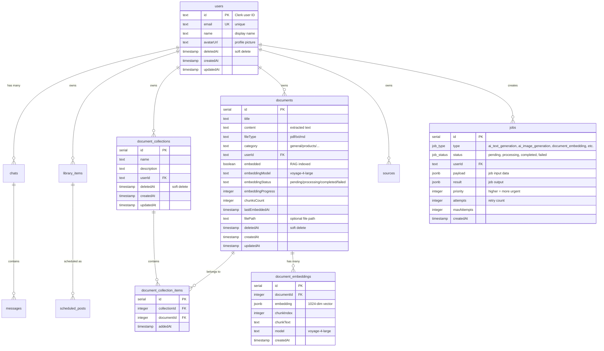

# Architecture Overview

This document describes the high-level architecture, design patterns, and technical decisions for the **Máquina de Conteúdo** repository.

## System Topology

The application is an **AI-Powered Content Studio** built with Next.js (App Router), featuring authentication, background job processing, and a PostgreSQL database. It follows a serverless-first architecture optimized for deployment on platforms like Vercel.

### High-Level Diagram

```mermaid
graph TD
    User[Browser/Client] -->|HTTP Request| Edge[Clerk Middleware]
    Edge -->|Protected Routes| App[Next.js App Router]
    Edge -->|Public Routes| App

    App -->|Auth| Clerk[Clerk Authentication]
    App -->|Webhooks| Webhook[/api/webhooks/clerk]

    subgraph Frontend Logic
        App --> Layouts[RootLayout + ClerkProvider]
        Layouts --> Pages[Sign In / Sign Up / Protected Routes]
        Pages --> Components[UI Components]
        Components --> UI[shadcn/ui Components]
    end

    subgraph Backend Services
        App --> DB[Neon PostgreSQL]
        App --> Queue[Upstash Redis Queue]
        App --> Workers[/api/workers Processor]
    end

    subgraph External Integrations
        Workers --> APIs[OpenRouter / Firecrawl / Social APIs]
    end
```

## Technology Stack

| Layer | Technology | Version | Purpose |
|-------|------------|---------|---------|
| **Core Framework** | Next.js | 16.1.1 | App Router, SSR/CSR, Routing |
| **Language** | TypeScript | 5.x | Static typing and interfaces |
| **Styling** | Tailwind CSS | 4.x | Utility-first CSS |
| **UI Library** | Radix UI | - | Headless accessible components |
| **Authentication** | Clerk | 6.36.7 | User auth and session management |
| **Database** | Neon PostgreSQL | 17 | Serverless PostgreSQL |
| **ORM** | Drizzle ORM | 0.45.x | Type-safe database queries |
| **Queue** | Upstash Redis | 1.36.x | Background job processing |
| **Icons** | Lucide React | - | Iconography |
| **Animation** | Framer Motion, GSAP | - | Declarative animations |

## Directory Structure

```
/src
├── /app                    # Next.js App Router
│   ├── /api                # API Routes
│   │   ├── /jobs           # Job management (CRUD)
│   │   ├── /jobs/[id]      # Job status endpoint
│   │   ├── /workers        # Queue processor
│   │   ├── /webhooks       # Clerk webhook sync
│   │   └── /documents      # Document upload (FormData + PDF parse) ⭐
│   │       └── /upload      # PDF/TXT/MD upload with text extraction
│   ├── /sign-in            # Clerk sign-in page
│   ├── /sign-up            # Clerk sign-up page
│   ├── /styleguide         # Design system documentation
│   ├── layout.tsx          # Root layout + ClerkProvider
│   └── globals.css         # Global styles + design tokens
│
├── /components             # React components
│   └── /ui                 # shadcn/ui components (30+ components)
│
├── /db                     # Database layer
│   ├── index.ts            # Neon connection (HTTP adapter)
│   └── schema.ts           # Drizzle schema (10+ tables)
│
├── /lib                    # Utilities
│   ├── utils.ts            # cn() + helpers
│   └── /queue              # Queue system
│       ├── types.ts        # JobType, JobStatus enums
│       ├── client.ts       # Upstash Redis client
│       └── jobs.ts         # Job CRUD functions
│
├── /hooks                  # Custom React hooks
│   └── use-mobile.ts       # useIsMobile() hook
│
└── middleware.ts           # Clerk route protection
```

## Database Schema

### 10+ Tables



### Table Purposes

| Table | Purpose | Key Fields |
|-------|---------|------------|
| `users` | Clerk sync | id (Clerk), email, deletedAt |
| `chats` | AI conversations | userId, title, model |
| `messages` | Chat messages | chatId, role, content |
| `library_items` | Content library | type, status, content (JSONB) |
| `documents` | Knowledge base | title, content, fileType, category |
| `document_collections` | Document folders | name, description, userId |
| `document_collection_items` | Many-to-many junction | collectionId, documentId |
| `document_embeddings` | RAG embeddings | documentId, embedding (JSONB), chunkIndex |
| `sources` | Scraping sources | url, type, config (JSONB) |
| `scheduled_posts` | Publishing queue | platform, scheduledFor, status |
| `jobs` | Background jobs | type, status, payload, attempts |

## Queue System Architecture

### Job Processing Flow


### Job Types

| Type | Description | Handler Status |
|------|-------------|-----------------|
| `ai_text_generation` | Generate text with AI | 🔄 Mock |
| `ai_image_generation` | Generate images with AI | 🔄 Mock |
| `carousel_creation` | Create social carousels | 🔄 Mock |
| `scheduled_publish` | Publish to social media | 🔄 Mock |
| `web_scraping` | Scrape web content | 🔄 Mock |
| `document_embedding` | Generate embeddings for RAG | ⭐ Ready |

## Authentication Flow

### Clerk Integration


### Protected Routes

- **Protected:** `/chat`, `/library`, `/calendar`, `/sources`, `/settings`
- **Public:** `/`, `/sign-in`, `/sign-up`, `/api/webhooks`

## Design Patterns

### 1. Serverless Queue Pattern

Workers are API routes triggered externally, eliminating need for continuous processes:

```typescript
// Worker is called by cron job or webhook
export async function POST(request: Request) {
  const jobId = await dequeueJob();
  if (!jobId) return { message: "No jobs" };

  const job = await getJob(jobId);
  const result = await jobHandlers[job.type](job.payload);

  await updateJobStatus(jobId, "completed", { result });
  return { jobId, result };
}
```

### 2. Type-Safe Database Queries

Drizzle ORM provides full TypeScript type safety:

```typescript
export type Job = typeof jobs.$inferSelect;
export type NewJob = typeof jobs.$inferInsert;
export type JobType = typeof jobTypeEnum.enumValues[number];
```

### 3. Priority Queue via String Scoring

```typescript
// Higher priority = lower score (processed first)
const score = `${String(999999 - priority).padStart(6, "0")}:${Date.now()}:${jobId}`;
await redis.lpush(QUEUE, score);
```

## Key Decisions

### 1. HTTP Adapter for Database

Used `drizzle-orm/neon-http` for Edge Runtime compatibility over traditional connection pooling.

### 2. Soft Delete Pattern

All user-owned tables use `deletedAt` timestamp instead of physical deletion.

### 3. JSONB for Flexible Data

Payloads and content fields use `jsonb` with TypeScript type inference for schema flexibility.

### 4. Webhook Sync over Polling

Clerk webhooks keep database in sync rather than fetching user data on each request.

## Future Considerations

- [ ] Implement real AI handlers (OpenRouter, Firecrawl)
- [ ] Add dead letter queue for permanently failed jobs
- [ ] Create job monitoring dashboard
- [ ] Implement job scheduling (cron within queue)
- [ ] Add rate limiting for job creation

---

*Updated based on codebase analysis as of Jan 16, 2026 (Fase 8 - Document Collections & File Upload).*
