# Architecture Overview

This document describes the high-level architecture, design patterns, and technical decisions for the **Máquina de Conteúdo** repository.

## System Topology

The application is an **AI-Powered Content Studio** built with Next.js (App Router), featuring authentication, background job processing, and a PostgreSQL database. It follows a serverless-first architecture optimized for deployment on platforms like Vercel.

### High-Level Diagram

```mermaid
graph TD
    User[Browser/Client] -->|HTTP Request| Edge[Clerk Middleware]
    Edge -->|Protected Routes| App[Next.js App Router]
    Edge -->|Public Routes| App

    App -->|Auth| Clerk[Clerk Authentication]
    App -->|Webhooks| Webhook[/api/webhooks/clerk]

    subgraph Frontend Logic
        App --> Layouts[RootLayout + ClerkProvider]
        Layouts --> Pages[Sign In / Sign Up / Protected Routes]
        Pages --> Components[UI Components]
        Components --> UI[shadcn/ui Components]
    end

    subgraph Backend Services
        App --> DB[Neon PostgreSQL]
        App --> Queue[Upstash Redis Queue]
        App --> Workers[/api/workers Processor]
    end

    subgraph Storage Layer
        App --> Storage[Storage Abstraction]
        Storage --> Local[LocalStorageProvider]
        Storage --> R2[R2StorageProvider]
        R2 --> CloudR2[Cloudflare R2]
        R2 --> CustomDomain[storage-mc.zoryon.org]
    end

    subgraph External Integrations
        Workers --> APIs[OpenRouter / Firecrawl / Social APIs]
    end
```

## Technology Stack

| Layer | Technology | Version | Purpose |
|-------|------------|---------|---------|
| **Core Framework** | Next.js | 16.1.1 | App Router, SSR/CSR, Routing |
| **Language** | TypeScript | 5.x | Static typing and interfaces |
| **Styling** | Tailwind CSS | 4.x | Utility-first CSS |
| **UI Library** | Radix UI | - | Headless accessible components |
| **Authentication** | Clerk | 6.36.7 | User auth and session management |
| **Database** | Neon PostgreSQL | 17 | Serverless PostgreSQL |
| **ORM** | Drizzle ORM | 0.45.x | Type-safe database queries |
| **Queue** | Upstash Redis | 1.36.x | Background job processing |
| **Storage** | Cloudflare R2 | - | S3-compatible object storage |
| **Storage SDK** | AWS SDK v3 | 3.x | S3 client for R2 operations |
| **AI SDK** | Vercel AI SDK | 1.x | LLM streaming + hooks |
| **LLM Provider** | OpenRouter | - | Multi-model aggregation |
| **Embeddings** | Voyage AI | - | RAG embeddings (1024-dim) |
| **Icons** | Lucide React | - | Iconography |
| **Animation** | Framer Motion, GSAP | - | Declarative animations |

## Directory Structure

```
/src
├── /app                    # Next.js App Router
│   ├── /api                # API Routes
│   │   ├── /jobs           # Job management (CRUD)
│   │   ├── /jobs/[id]      # Job status endpoint
│   │   ├── /workers        # Queue processor
│   │   ├── /webhooks       # Clerk webhook sync
│   │   ├── /wizard         # Wizard de Criação (CRUD + submit)
│   │   │   ├── route.ts    # GET (list), POST (create)
│   │   │   └── /[id]       # GET, PATCH, DELETE, /submit
│   │   ├── /documents      # Document management
│   │   │   ├── /upload      # PDF/TXT/MD upload with text extraction
│   │   │   └── /[id]        # Download document from storage
│   │   └── /admin          # Admin operations
│   │       └── /clear-documents # Bulk delete all user documents
│   ├── /sign-in            # Clerk sign-in page
│   ├── /sign-up            # Clerk sign-up page
│   ├── /styleguide         # Design system documentation
│   ├── layout.tsx          # Root layout + ClerkProvider
│   └── globals.css         # Global styles + design tokens
│
├── /components             # React components
│   └── /ui                 # shadcn/ui components (30+ components)
│
├── /db                     # Database layer
│   ├── index.ts            # Neon connection (HTTP adapter)
│   └── schema.ts           # Drizzle schema (10+ tables)
│
├── /lib                    # Utilities
│   ├── utils.ts            # cn() + helpers
│   ├── /ai                 # Vercel AI SDK config
│   │   └── config.ts       # openrouter client, models
│   ├── /voyage             # Voyage AI embeddings
│   │   ├── index.ts        # client with env + DB fallback
│   │   └── embeddings.ts   # generateEmbedding()
│   ├── /rag                # RAG utilities
│   │   ├── index.ts        # types, constants (client-safe)
│   │   ├── assembler.ts    # assembleRagContext() (server-only)
│   │   └── filters.ts      # relevance filters
│   ├── /storage            # Storage abstraction layer ⭐
│   │   ├── types.ts        # StorageProvider enum, interfaces
│   │   ├── config.ts       # R2 credentials, getR2PublicUrl()
│   │   ├── /providers      # Storage implementations
│   │   │   ├── local.ts    # LocalStorageProvider (filesystem)
│   │   │   └── r2.ts       # R2StorageProvider (S3 client)
│   │   └── /utils          # Storage helpers
│   │       └── file-url.ts # getDocumentUrl(), hasStorageLocation()
│   └── /queue              # Queue system
│       ├── types.ts        # JobType, JobStatus enums
│       ├── client.ts       # Upstash Redis client
│       └── jobs.ts         # Job CRUD functions
│
├── /hooks                  # Custom React hooks
│   └── use-mobile.ts       # useIsMobile() hook
│
└── middleware.ts           # Clerk route protection
```

## Database Schema

### 10+ Tables


### Table Purposes

| Table | Purpose | Key Fields |
|-------|---------|------------|
| `users` | Clerk sync | id (Clerk), email, deletedAt |
| `chats` | AI conversations | userId, title, model |
| `messages` | Chat messages | chatId, role, content |
| `library_items` | Content library | type, status, content (JSONB) |
| `content_wizards` | Wizard de Criação state | currentStep, narratives (JSONB), generatedContent (JSONB) |
| `documents` | Knowledge base | title, content, fileType, category, storageProvider, storageKey |
| `document_collections` | Document folders | name, description, userId |
| `document_collection_items` | Many-to-many junction | collectionId, documentId |
| `document_embeddings` | RAG embeddings | documentId, embedding (JSONB), chunkIndex |
| `sources` | Scraping sources | url, type, config (JSONB) |
| `scheduled_posts` | Publishing queue | platform, scheduledFor, status |
| `jobs` | Background jobs | type, status, payload, attempts |

## Storage Architecture

### Overview

The application uses a **storage abstraction layer** that supports multiple providers:
- **LocalStorageProvider**: Filesystem-based storage for development
- **R2StorageProvider**: Cloudflare R2 for production (S3-compatible)

This design allows seamless switching between providers via environment variable configuration.

### Storage Flow


### Provider Configuration

**Environment Variables:**
```env
STORAGE_PROVIDER=local|r2

# R2 Configuration (required when STORAGE_PROVIDER=r2)
R2_ACCOUNT_ID=11feaa2d9e21cd5a972bccfcb8d1e3d7
R2_ACCESS_KEY_ID=xxx
R2_SECRET_ACCESS_KEY=xxx
R2_BUCKET_NAME=maquina-de-conteudo
R2_CUSTOM_DOMAIN=storage-mc.zoryon.org
R2_ENDPOINT=https://<account-id>.r2.cloudflarestorage.com
```

### Storage Key Pattern

**R2 Storage Keys:** `documents/{userId}/{timestamp}-{sanitizedFilename}`

Example: `documents/user_abc123/1234567890-my-document.pdf`

**Local File Paths:** `/uploads/documents/{userId}/{timestamp}-{sanitizedFilename}`

### Public URL Generation

```typescript
// R2 with custom domain
https://storage-mc.zoryon.org/documents/user_abc123/1234567890-my-document.pdf

// R2 with public URL (fallback)
https://pub-xxx.r2.dev/maquina-conteudo/documents/user_abc123/...

// Local (development)
http://localhost:3000/uploads/documents/user_abc123/...
```

### Storage Interface

```typescript
interface StorageProvider {
  uploadFile(buffer: Buffer, key: string): Promise<StorageResult>
  deleteFile(key: string): Promise<void>
  getFileUrl(key: string): string
  batchDelete(keys: string[]): Promise<BatchResult>
}

interface StorageResult {
  provider: "local" | "r2"
  storageKey: string
  url: string
}
```

### CORS Configuration

R2 bucket CORS allows public read access from:

| Origin | Purpose |
|--------|---------|
| `http://localhost:3000` | Local development |
| `https://maquina-de-conteudo.vercel.app` | Production app |
| `https://storage-mc.zoryon.org` | Custom domain |
| `https://*.zoryon.org` | Wildcard subdomains |

**Allowed Methods:** `GET`, `HEAD`

### Document Deletion Flow


### Admin Operations

**Bulk Delete Endpoint:** `DELETE /api/admin/clear-documents`

Deletes ALL user documents including:
1. Storage files (R2 + local)
2. Embeddings
3. Collection associations
4. Document records

**Response:**
```json
{
  "success": true,
  "deleted": {
    "documents": 42,
    "files": 42,
    "embeddings": 42,
    "collectionItems": 15
  },
  "steps": ["Fetching documents...", "✓ Deleted 42 R2 files", "..."]
}
```

## Queue System Architecture

### Job Processing Flow


### Job Types

| Type | Description | Handler Status |
|------|-------------|-----------------|
| `ai_text_generation` | Generate text with AI | 🔄 Mock |
| `ai_image_generation` | Generate images with AI | 🔄 Mock |
| `carousel_creation` | Create social carousels | 🔄 Mock |
| `scheduled_publish` | Publish to social media | 🔄 Mock |
| `web_scraping` | Scrape web content | 🔄 Mock |
| `document_embedding` | Generate embeddings for RAG | ⭐ Ready |
| `wizard_narratives` | Generate narrative options for Wizard | ⭐ Implemented (Jan 2026) |
| `wizard_generation` | Generate final content from Wizard | ⭐ Implemented (Jan 2026) |
| `wizard_image_gen` | Generate images for Wizard slides | ⭐ Implemented (Jan 2026) |
| `social_publish_instagram` | Publish to Instagram (async) | ⭐ Implemented (Jan 2026) |
| `social_publish_facebook` | Publish to Facebook (async) | ⭐ Implemented (Jan 2026) |

### Worker Triggering: Development vs Production

**CRITICAL:** Vercel Cron (`vercel.json`) only works in production deployment. Development requires manual triggering.

| Environment | Trigger Method | Implementation |
|-------------|----------------|----------------|
| **Development** | Manual via `triggerWorker()` | Called after job creation |
| **Production** | Vercel Cron | Every minute via `vercel.json` |

```typescript
// Auto-trigger pattern in development
import { triggerWorker } from "@/lib/queue/client";

function isDevelopment(): boolean {
  return process.env.NODE_ENV === "development";
}

// After creating a job
if (isDevelopment()) {
  triggerWorker().catch((err) => {
    console.error("Failed to trigger worker in development:", err);
  });
}
```

**Worker Authentication:** The `/api/workers` endpoint bypasses Clerk auth and uses `WORKER_SECRET` instead (configured in `src/proxy.ts`).

## Error Handling Architecture (Jan 2026)

### Overview

The application uses a **type-safe error handling system** with specific error types instead of catch-all patterns. This provides better debugging, user-friendly error messages, and consistent error logging.

### Error Class Hierarchy

**File:** `src/lib/errors.ts`


### Helper Functions

| Function | Purpose |
|----------|---------|
| `toAppError(error, code)` | Normalize unknown error to AppError |
| `getErrorMessage(error)` | Safely extract error message |
| `getErrorCode(error)` | Safely extract error code |
| `isAppError(error)` | Type guard for AppError |
| `hasErrorCode(error)` | Type guard for objects with code property |
| `isRetryableError(error)` | Check if error is retryable |

### Error Handling Patterns

#### 1. API Route Pattern

```typescript
import { toAppError, getErrorMessage, isAuthError, hasErrorCode } from "@/lib/errors"

export async function POST(request: Request) {
  try {
    // ... operations
  } catch (error) {
    const appError = toAppError(error, "OPERATION_FAILED")
    console.error("[Context] Error:", appError)

    // Handle specific error types
    if (hasErrorCode(error) && error.code === "TOKEN_EXPIRED") {
      return NextResponse.json(
        { error: "Sessão expirada. Por favor, reconecte." },
        { status: 400 }
      )
    }

    return NextResponse.json(
      { error: getErrorMessage(appError) },
      { status: appError.statusCode }
    )
  }
}
```

#### 2. Batch Operations Pattern

Used in workers where individual failures shouldn't stop entire batch:

```typescript
const errors: Array<{ id: number; error: string }> = []
let successCount = 0

for (const item of items) {
  try {
    await processItem(item)
    successCount++
  } catch (error) {
    const errorMsg = error instanceof Error ? error.message : String(error)
    console.error(`[Context] Error processing ${item.id}:`, errorMsg)
    errors.push({ id: item.id, error: errorMsg })
  }
}

// Log summary
if (errors.length > 0) {
  console.warn(`[Context] ${errors.length}/${items.length} failed`)
}

return { success: true, successCount, errors: errors.length > 0 ? errors : undefined }
```

#### 3. Safe JSON Parsing

```typescript
function parseJsonSafely<T = unknown>(
  json: string | null | undefined,
  fallback: T = {} as T
): T {
  if (!json) return fallback
  try {
    const parsed = JSON.parse(json)
    return typeof parsed === "object" && parsed !== null ? parsed as T : fallback
  } catch (error) {
    console.error("[Context] Failed to parse JSON:", error)
    return fallback
  }
}
```

### Error Handling by Module

| Module | Error Pattern | File |
|--------|---------------|------|
| **Queue** | JobError with jobId context | `src/lib/queue/client.ts` |
| **Social Publish** | Token expiry detection + connection marking | `src/app/api/social/publish/route.ts` |
| **Metrics Fetch** | Error grouping + summary logging | `src/lib/social/workers/fetch-metrics.ts` |
| **Workers** | Safe metadata parsing | `src/app/api/workers/route.ts` |

## Authentication Flow

### Clerk Integration


### Protected Routes

- **Protected:** `/chat`, `/library`, `/calendar`, `/sources`, `/settings`
- **Public:** `/`, `/sign-in`, `/sign-up`, `/api/webhooks`

## AI/LLM Integration

### Architecture (Vercel AI SDK + OpenRouter)


### Environment Variables (System-Controlled)

| Variable | Required | Purpose |
|----------|----------|---------|
| `OPENROUTER_API_KEY` | ✅ Yes | LLM access via Vercel AI SDK |
| `VOYAGE_API_KEY` | ✅ Yes | Embeddings for RAG |
| `FIRECRAWL_API_KEY` | ⬜ No | Web scraping |
| `TAVILY_API_KEY` | ⬜ No | Real-time search |

**Note:** API keys are now system-controlled (environment variables) rather than user-controlled (database-encrypted). This was changed in January 2026 for a B2B model where the company provides AI services.

### Available Models

**Text Models (12):**
- OpenAI: gpt-5-mini, gpt-5.1, gpt-5.2, gpt-4.1, gpt-4.1-mini
- Anthropic: claude-sonnet-4.5, claude-opus-4.5, claude-haiku-4.5
- Google: gemini-3-flash-preview, gemini-3-pro-preview
- xAI: grok-4.1-fast, grok-4

**Image Models (4):**
- google/gemini-3-pro-image-preview
- openai/gpt-5-image
- bytedance-seed/seedream-4.5
- black-forest-labs/flux.2-max

### RAG (Retrieval Augmented Generation)


**Voyage AI Config:**
- Model: `voyage-4-large`
- Dimensions: 1024
- Chunk Size: **Category-specific** (800-1300 tokens)
- Overlap: 100-200 tokens (varies by category)
- Similarity Threshold: 0.4 (improved recall for tribal content - unified)

**Category-Specific Chunking:**
| Category | Chunk Size | Overlap | Use Case |
|----------|------------|---------|----------|
| `products` | 800 | 100 | Product catalog |
| `offers` | 900 | 150 | Promotions, discounts |
| `brand` | 1300 | 200 | Voice, values, mission |
| `audience` | 1000 | 150 | Personas, demographics |
| `competitors` | 900 | 150 | Competitive analysis |
| `content` | 1200 | 180 | Posts, calendars |
| `general` | 1000 | 150 | Default balanced |

### useChat Streaming Patterns

**Client Component Pattern:**
```typescript
import { useChat } from "@ai-sdk/react"
import { DefaultChatTransport } from "ai"

const { messages, status, error, sendMessage, stop } = useChat({
  transport: new DefaultChatTransport({
    api: "/api/chat",
    body: {
      agent: "zory",
      model: "gpt-5-mini",
      categories: ["brand", "products"],
      useRag: true,
    },
  }),
  onFinish: ({ message }) => {
    const text = getMessageText(message)
    onComplete?.(text)
  },
})

// Send message with SDK v3 format
sendMessage(
  { parts: [{ type: "text", text: messageToSend }] },
  { body: { agent, model, categories, useRag } }
)
```

**Message Format (SDK v3 UIMessage):**
```typescript
interface UIMessage {
  id: string
  role: "user" | "assistant" | "system"
  parts: Array<{
    type: string
    text?: string
  }>
}
```

**Memoization for Performance:**
```typescript
// Helper function with useCallback
const getMessageText = useCallback((message: UIMessage): string => {
  if (!message.parts) return ""
  return message.parts
    .filter((part) => part.type === "text" && part.text)
    .map((part) => part.text)
    .join("")
}, [])

// Derived values with useMemo to prevent infinite loops
const lastResponseText = useMemo(() => {
  const lastAssistantMessage = messages.filter((m) => m.role === "assistant").pop()
  return lastAssistantMessage ? getMessageText(lastAssistantMessage) : null
}, [messages, getMessageText])
```

### System Status Monitoring

```typescript
const status = await getSystemStatusAction()
// Returns:
// {
//   overallConfigured: boolean,
//   services: {
//     openrouter: { configured: boolean, source: "env" },
//     voyage: { configured: boolean, source: "env" | "database" },
//     firecrawl: { configured: boolean, source: "none" },
//     tavily: { configured: boolean, source: "none" }
//   }
// }
```

---

## Wizard de Criação Architecture

### Overview

The **Wizard de Criação** (Creation Wizard) is a multi-step form that guides users through AI-powered content creation. It implements a state machine pattern with auto-save and background job processing.

### Wizard Flow


### Component Structure

```
src/app/(app)/wizard/
├── page.tsx                          # Route entry (redirects to new or existing)
├── components/
│   ├── wizard-page.tsx               # Main orchestrator (Client Component)
│   ├── wizard-dialog.tsx             # Modal wrapper + useWizardDialog() hook
│   ├── steps/
│   │   ├── step-1-inputs.tsx         # Form: content type, references, details
│   │   ├── step-2-processing.tsx     # Polling: narratives generation
│   │   ├── step-3-narratives.tsx     # Selection: 4 narrative cards
│   │   └── step-4-generation.tsx     # Preview: final content + actions
│   └── shared/
│       ├── narrative-card.tsx        # Individual narrative card component
│       ├── document-config-form.tsx  # RAG configuration (documents/collections)
│       └── wizard-steps-indicator.tsx # Progress indicator (1-4)
```

### Database Schema (content_wizards)

```typescript
// src/db/schema.ts
export const contentWizards = pgTable("content_wizards", {
  id: serial("id").primaryKey(),
  userId: text("user_id").notNull().references(() => users.id),

  // Step 1: Inputs
  contentType: text("content_type"), // "text" | "image" | "carousel" | "video"
  numberOfSlides: integer("number_of_slides"),
  model: text("model"),
  referenceUrl: text("reference_url"),
  referenceVideoUrl: text("reference_video_url"),
  theme: text("theme"),
  context: text("context"),
  objective: text("objective"),
  cta: text("cta"), // Call to Action
  targetAudience: text("target_audience"),
  negativeTerms: text("negative_terms").array(),

  // Step 2: Processing
  extractedContent: jsonb("extracted_content"), // From Firecrawl/Apify
  researchQueries: jsonb("research_queries"), // From Tavily

  // Step 3: Narratives (4 options with different angles)
  narratives: jsonb("narratives"), // [{id, angle, title, description, content}]
  selectedNarrativeId: text("selected_narrative_id"),
  customInstructions: text("custom_instructions"),

  // RAG Configuration
  ragConfig: jsonb("rag_config"), // {mode, threshold, maxChunks, documents[], collections[]}

  // Step 4: Generation
  generatedContent: jsonb("generated_content"), // {slides, caption, hashtags}
  libraryItemId: integer("library_item_id").references(() => libraryItems.id),

  // State
  currentStep: text("current_step").notNull(), // "input" | "processing" | "narratives" | "generation" | "completed" | "abandoned"
  jobStatus: text("job_status"), // "pending" | "processing" | "completed" | "failed"
  jobError: text("job_error"),
  processingProgress: jsonb("processing_progress"), // {stage, percent}

  timestamps,
})
```

### API Endpoints

| Endpoint | Method | Purpose |
|----------|--------|---------|
| `/api/wizard` | GET | List user's wizards (paginated) |
| `/api/wizard` | POST | Create new wizard (step: "input") |
| `/api/wizard/[id]` | GET | Fetch wizard data |
| `/api/wizard/[id]` | PATCH | Update wizard (auto-save, step transitions) |
| `/api/wizard/[id]` | DELETE | Soft delete (currentStep: "abandoned") |
| `/api/wizard/[id]/submit` | POST | Trigger background job (narratives or generation) |

### Narrative Angles (Tribal v4)

The Wizard generates 4 narrative options based on Seth Godin's "Tribes" philosophy:

| Angle | Label | Color | Description |
|-------|-------|-------|-------------|
| `herege` | Herege | red-400 | Desafia o senso comum, provoca reflexão |
| `visionario` | Visionário | purple-400 | Mostra futuro possível, inspira mudança |
| `tradutor` | Tradutor | blue-400 | Simplifica o complexo, democratiza conhecimento |
| `testemunha` | Testemunha | green-400 | Compartilha jornada pessoal, cria identificação |

**Tribal Fields (v4):**
- `hook`: Primeira frase que cria reconhecimento imediato
- `core_belief`: Crença compartilhada que une criador e audiência
- `status_quo_challenged`: O que o conteúdo questiona |

### Background Jobs

**wizard_narratives Job:**
1. Extract content from `referenceUrl` (Firecrawl REST API)
2. Transcribe `referenceVideoUrl` (Apify YouTube Transcript Actor)
3. Search context with Tavily Search API
4. **Synthesize research** (Synthesizer v3.1) → structured research fields
5. Generate RAG context if configured
6. Generate 4 narratives with LLM (OpenRouter via Vercel AI SDK)
7. Update wizard with narratives + synthesizedResearch

**wizard_generation Job:**
1. Fetch wizard with selected narrative
2. Fetch synthesized research from step 2
3. Generate RAG context if configured
4. Generate final content (slides, caption, hashtags) with LLM
5. Update wizard with generatedContent

**wizard_image_gen Job (Phase 2):**
1. Fetch wizard with generated content
2. For each slide:
   - Generate image using AI (OpenRouter) OR
   - Generate HTML template (ScreenshotOne)
3. Update wizard with generatedImages
4. Update status to "completed"

### Wizard Services Module

**Localização**: `src/lib/wizard-services/`

Módulo de serviços para processamento de jobs do Wizard:

```
src/lib/wizard-services/
├── types.ts                    # Shared types (NarrativeAngle, ContentType, ServiceResult)
├── synthesis-types.ts          # Synthesizer v3.1 research types
├── image-types.ts              # Image generation configuration types
├── prompts.ts                  # Tribal v4 prompts (base-tribal, carousel v4.2, image/video v3.0)
├── llm.service.ts              # LLM generation with retry logic
├── rag.service.ts              # RAG wrapper with graceful degradation
├── synthesizer.service.ts      # Research synthesis v3.1
├── image-generation.service.ts # AI image generation
├── screenshotone.service.ts    # HTML template rendering
├── firecrawl.service.ts        # Web scraping (optional)
├── tavily.service.ts           # Contextual search (optional)
├── apify.service.ts            # YouTube transcription (optional)
└── index.ts                    # Barrel exports
```

**Key Features**:
- **Graceful Degradation**: Optional services return null if not configured
- **Prompts Isolados**: Each content type has its own prompt function
- **Retry Logic**: Exponential backoff for LLM calls
- **Type-Safe**: Full TypeScript interfaces

### State Management

The `WizardPage` component manages all state locally with debounced auto-save:

```typescript
// Auto-save to database every 1s of inactivity
useEffect(() => {
  const handler = setTimeout(() => {
    if (wizardId) {
      fetch(`/api/wizard/${wizardId}`, {
        method: "PATCH",
        body: JSON.stringify({ currentStep, formData }),
      })
    }
  }, 1000)
  return () => clearTimeout(handler)
}, [formData])
```

### Visual Patterns

**Important:** The Wizard uses a gradient background `from-[#0a0a0f] to-[#1a1a2e]` WITHOUT the `.dark` class. All form inputs must use explicit color overrides:

```tsx
// Pattern for visible inputs in gradient backgrounds
className="!border-white/10 !bg-white/[0.02] !text-white !placeholder:text-white/40 focus-visible:!border-primary/50"
```

**CollapsibleSection Component:**
- Radix UI Collapsible + Framer Motion animations
- Header with icon, title, description
- Expandable content area
- Used in Step 1 for organizing form sections

## Discovery Architecture

### Overview

The Discovery feature enables users to find trending topics across multiple platforms (YouTube, Instagram, Perplexity) and seamlessly convert them into Wizard-ready content with AI-powered theme processing.

### Discovery Flow


### Services Architecture

**Location**: `src/lib/discovery-services/`

```typescript
// Service structure
discovery-services/
├── types.ts                          # Platform types, TrendingTopic
├── discovery.service.ts               # Orchestration layer
├── youtube/
│   ├── youtube-discovery.service.ts  # YouTube Data API client
│   └── index.ts
├── instagram/
│   ├── search-scraper.service.ts     # Post search
│   ├── stats-scraper.service.ts      # Hashtag stats
│   └── index.ts                       # Facade
└── perplexity/
    ├── perplexity-discovery.service.ts  # Perplexity API client
    ├── theme-processor.service.ts       # AI processing (Perplexity)
    └── index.ts
```

### AI Theme Processing

All saved themes are processed by AI before creating a Wizard:


**Processing Results**:
- **Perplexity**: theme, context, objective, referenceUrl (from citations)
- **Instagram**: theme, context, objective, suggestedContentType
- **YouTube**: theme, context, objective, suggestedContentType

### API Routes

```
POST /api/discovery
  Body: { keyword: string, platforms: Platform[] }
  Response: { topics: TrendingTopic[] }

POST /api/themes
  Body: { title, theme, context, sourceType, sourceUrl, ... }
  Response: { theme: Theme }

POST /api/themes/[id]/wizard
  Creates wizard with AI-processed theme data
  Response: { wizardId, theme }
```

### Tabs UI Pattern

Results are displayed in platform-specific tabs with color coding:

| Platform | Color | Icon |
|----------|-------|------|
| YouTube | Red (`text-red-500`) | Youtube |
| Perplexity | Purple (`text-purple-500`) | Brain |
| Instagram | Pink Gradient (`from-yellow-400 via-pink-500 to-purple-600`) | Instagram |

### Platform Type

```typescript
type Platform = 'youtube' | 'instagram' | 'perplexity';
```

### Database Schema

**themes** table stores discovery results:

```typescript
{
  id: serial,
  userId: string,           // Clerk user ID
  title: string,            // Display title
  theme: string,            // Main theme
  context?: string,         // Additional context
  objective?: string,        // Content objective
  sourceType: 'theme_source_type',  // manual|youtube|instagram|perplexity|aggregated
  sourceUrl?: string,       // Original URL
  targetAudience?: string,  // Target audience
  briefing?: string,        // AI-generated briefing
  keyPoints?: string[],     // Key points from briefing
  angles?: string[],        // Suggested angles
  sourceData?: JSONB,       // Platform-specific data (citations, etc.)
  status: 'theme_status',   // draft|active|archived
  deletedAt?: timestamp,    // Soft delete
  createdAt: timestamp,
  updatedAt: timestamp
}
```

### External APIs

| Service | API | Model/Version | Purpose |
|---------|-----|--------------|---------|
| YouTube | Google Data API v3 | - | Video search |
| Instagram | Apify | Instagram Scraper | Post/stats scraping |
| Perplexity | Perplexity API | sonar | AI search with citations |
| Theme Processing | OpenRouter | gemini-2.0-flash-exp:free | Theme refinement |

## Social Media Integration (Instagram/Facebook)

### Overview

The Social Media Integration enables users to connect their Instagram Business and Facebook accounts, publish content immediately or schedule for future, and track published posts.

### Async Publishing Architecture (Jan 2026)

**Critical Change**: Immediate publishing now uses async job queue to prevent UI blocking. Instagram Content Publishing API takes 30-60 seconds to process.

```mermaid
sequenceDiagram
    participant User
    participant UI as ContentActionsSection
    participant API as /api/social/publish
    participant DB as publishedPosts
    participant Queue as Upstash Redis
    participant Worker as /api/workers
    participant IG as Instagram API

    User->>UI: Click "Publicar Agora"
    UI->>API: POST /api/social/publish
    API->>DB: INSERT (status: PUBLISHING)
    API->>Queue: LPUSH job (priority: 1)
    API-->>UI: { queued: true, jobId }
    UI->>User: Toast "Publicação enfileirada"

    Note over Worker: Triggered by cron (1min)

    Worker->>Queue: RPOP job
    Worker->>IG: Create container
    loop Polling (30-60s)
        IG->>IG: Processing media
    end
    IG-->>Worker: FINISHED
    Worker->>IG: POST media_publish
    IG-->>Worker: { id: mediaId }
    Worker->>DB: UPDATE status: PUBLISHED
```



**Status Flow**:
```
PUBLISHING → (worker processing 30-60s) → PUBLISHED
                                      ↓
                                   FAILED
```

**Client Response Pattern**:
```typescript
// POST /api/social/publish response
{
  success: true,
  publishedPostId: 123,
  jobId: 456,
  queued: true,  // Indicates async processing
  message: "Publicação enfileirada. Você será notificado quando concluída."
}
```

### Integration Architecture

```mermaid
graph TD
    User[User] --> Connect[Connect Account]
    Connect --> OAuth[Meta OAuth Dialog]
    OAuth --> Callback[Callback Handler]
    Callback --> Session[Database Session]
    Session --> Select[Page/Account Selection]
    Select --> Save[Save Connection]

    subgraph Database Tables
        Session
        Save --> Connections[socialConnections]
        Publish[/api/social/publish]
        Publish --> Published[publishedPosts]
    end

    subgraph Publishing Flow
        Publish --> Immediate{Immediate?}
        Immediate -->|Yes| API[Instagram/Facebook API]
        Immediate -->|No| Scheduled[Scheduled Status]
        Scheduled --> Cron[Cron Worker]
        Cron --> API
    end

    API --> Result[Platform Post ID/URL]
    Result --> Published
```

### Meta OAuth Flow

**Database Session Storage** (Critical Pattern):

Next.js `NextResponse.redirect()` does NOT send `Set-Cookie` headers. This is a known limitation. Solution: store OAuth data in database with 15-minute TTL.


### Required OAuth Scopes

```typescript
const META_SCOPES = [
  // Instagram
  "instagram_basic",                    // Profile access
  "instagram_content_publish",          // Publish media
  "instagram_manage_insights",          // Metrics
  "instagram_manage_comments",          // Comment moderation

  // Facebook Page (required for IG Business)
  "pages_show_list",                    // List pages
  "pages_read_engagement",              // Engagement data
  "pages_read_user_content",            // User content
  "pages_manage_posts",                 // Create posts
  "pages_manage_metadata",              // Page metadata
  "business_management",                // Business account access
]
```

### Database Schema

**socialConnections** table:

```typescript
{
  id: serial,
  userId: string,                    // Clerk user ID
  platform: "instagram" | "facebook",
  accountId: string,                 // IG Business ID or FB Page ID
  accountName: string,               // Display name
  accountUsername: string,           // @username
  accessToken: string,               // Long-lived User Access Token
  pageId: string,                    // Facebook Page ID (for IG)
  pageAccessToken: string,           // Page Access Token (PRIMARY for publishing)
  pageName: string,                  // Facebook Page name
  tokenExpiresAt: timestamp,         // Token expiration (60 days)
  status: "active" | "expired" | "deleted",
  metadata: JSONB,                   // { igUserId, followersCount, permissions }
  lastVerifiedAt: timestamp,
  deletedAt: timestamp,              // Soft delete
  createdAt: timestamp,
  updatedAt: timestamp,
}
```

**oauthSessions** table (temporary, 15min TTL):

```typescript
{
  id: text (UUID),                   // Primary key
  userId: string,                    // Clerk user ID
  platform: "instagram" | "facebook",
  longLivedToken: string,            // User Access Token (60 days)
  tokenExpiresAt: timestamp,
  pagesData: JSONB,                  // { pages: PageWithInstagram[] }
  expiresAt: timestamp,              // 15 minutes from creation
  createdAt: timestamp,
}
```

**publishedPosts** table:

```typescript
{
  id: serial,
  userId: string,
  libraryItemId: integer | null,     // null for standalone posts
  platform: "instagram" | "facebook",
  mediaType: "image" | "video" | "carousel",
  caption: string | null,
  mediaUrl: string | null,           // JSON array of URLs
  status: "scheduled" | "publishing" | "published" | "failed" | "cancelled",
  scheduledFor: timestamp | null,
  publishedAt: timestamp | null,
  platformPostId: string | null,     // Platform's post ID
  platformPostUrl: string | null,    // Permalink URL
  errorMessage: string | null,
  deletedAt: timestamp,              // Soft delete
  createdAt: timestamp,
  updatedAt: timestamp,
}
```

### Instagram Publishing API

**Critical Pattern**: Use `graph.facebook.com` NOT `graph.instagram.com` for Content Publishing API.

**Token Usage**:
- **Page Access Token** (prefix `EAF`) - Primary token for publishing
- **User Access Token** (prefix `EAAE`) - For fetching pages/accounts

**POST Request Format** (JSON body, NOT query params):

```typescript
// Single Image
const response = await fetch(
  `https://graph.facebook.com/v22.0/${igUserId}/media`,
  {
    method: "POST",
    headers: { "Content-Type": "application/json" },
    body: JSON.stringify({
      image_url: "https://...",
      caption: "Legenda #hashtag",
      access_token: pageAccessToken,  // In BODY, not query param
    }),
  }
)
const { id: containerId } = await response.json()

// Wait for processing (polling)
while (attempts < maxAttempts) {
  const status = await fetch(
    `https://graph.facebook.com/v22.0/${containerId}?fields=status_code&access_token=${pageAccessToken}`
  )
  const { status_code } = await status.json()
  if (status_code === "FINISHED") break
  await sleep(2000)
}

// Publish
const publish = await fetch(
  `https://graph.facebook.com/v22.0/${igUserId}/media_publish`,
  {
    method: "POST",
    headers: { "Content-Type": "application/json" },
    body: JSON.stringify({
      creation_id: containerId,
      access_token: pageAccessToken,
    }),
  }
)
const { id: mediaId } = await publish.json()
```

**Carousel Publishing**:

```typescript
// 1. Create individual containers with is_carousel_item flag
const itemContainerIds = await Promise.all(
  imageUrls.map(url =>
    fetch(
      `https://graph.facebook.com/v22.0/${igUserId}/media`,
      {
        method: "POST",
        headers: { "Content-Type": "application/json" },
        body: JSON.stringify({
          image_url: url,
          is_carousel_item: true,  // IMPORTANT: Mark as carousel item
          access_token: pageAccessToken,
        }),
      }
    ).then(r => r.json()).then(r => r.id)
  )
)

// 2. Create carousel container
const carousel = await fetch(
  `https://graph.facebook.com/v22.0/${igUserId}/media`,
  {
    method: "POST",
    headers: { "Content-Type": "application/json" },
    body: JSON.stringify({
      media_type: "CAROUSEL",
      children: itemContainerIds.join(','),  // Comma-separated IDs
      caption: "Legenda #hashtag",  // Caption on parent only
      access_token: pageAccessToken,
    }),
  }
)

// 3. Poll + publish (same as single image)
```

### API Routes

| Route | Method | Purpose |
|------|--------|---------|
| `/api/social/oauth` | GET | Initiate OAuth flow |
| `/api/social/callback` | GET | OAuth callback handler |
| `/api/social/save-connection` | POST | Save selected connection |
| `/api/social/oauth-session` | GET | Fetch session pages |
| `/api/social/publish` | POST | Publish content |
| `/api/published-posts` | GET | List user's published posts |
| `/api/published-posts/[id]` | GET/PATCH/DELETE | Manage published post |

### Token Types

| Prefix | Type | Duration | Usage |
|---------|------|----------|-------|
| `EAA` / `EAAB` | User Access Token (Short-lived) | 1-2 hours | Initial OAuth exchange |
| `EAAE` | User Access Token (Long-lived) | 60 days | Fetch pages, debug |
| `EAD` | User Access Token (Long-lived - Legacy) | 60 days | Older format |
| `EAF` | Page Access Token | 60 days (effectively permanent) | **Content Publishing API** |

**For Instagram Content Publishing API**: Use **Page Access Token**.

### Common Errors

| Error | Cause | Solution |
|-------|-------|----------|
| "Cannot parse access token" | Using `graph.instagram.com` endpoint | Use `graph.facebook.com` |
| "Invalid OAuth access token" (code: 190) | Token expired or wrong token | Use Page Access Token, refresh connection |
| "(#100) No matching user found" | Wrong IG Business Account ID | Verify `accountId` matches IG Business |
| Rate Limited (code: 4) | Exceeded API quota | Implement backoff, check quota endpoint |

### Debugging

```typescript
// Debug token endpoint
const appAccessToken = `${META_APP_ID}|${META_APP_SECRET}`
const debugUrl = `https://graph.facebook.com/v21.0/debug_token?input_token=${token}&access_token=${appAccessToken}`

const debug = await fetch(debugUrl).then(r => r.json())
console.log(debug.data)
// {
//   type: "USER" | "PAGE",
//   is_valid: true,
//   scopes: ["instagram_basic", "instagram_content_publish", ...],
//   expires_at: 1234567890
// }
```

---

## Phase 2: Synthesizer v3.1 and Image Generation

### Overview

Phase 2 extends the Wizard de Criação with two critical capabilities:

1. **Synthesizer v3.1**: Intermediate LLM processing that transforms raw Tavily results into structured research
2. **Image Generation**: Dual-method image generation system (AI + HTML Templates)

### Updated Wizard Flow


### Synthesizer v3.1 Architecture

**Location**: `src/lib/wizard-services/synthesizer.service.ts`

The Synthesizer is a critical intermediate step that transforms raw Tavily search results into structured, actionable research fields before narrative generation.


**Key Output Fields**:

| Field | Type | Description |
|-------|------|-------------|
| `resumo_executivo` | string | Executive summary of research |
| `throughlines_potenciais` | ThroughlinePotencial[] | 3-5 throughlines with viral potential |
| `tensoes_narrativas` | TensoesNarrativa[] | Tensions that create engagement |
| `dados_contextualizados` | DadoContextualizado[] | Ready-to-use data phrases |
| `exemplos_narrativos` | ExemploNarrativo[] | Complete stories with outcomes |
| `erros_armadilhas` | ErroArmadilha[] | Counter-intuitive mistakes |
| `frameworks_metodos` | FrameworkMetodoV3[] | Validated frameworks |
| `hooks` | Hook[] | Opening hooks for slides |
| `progressao_sugerida` | ProgressaoSugeridaV3 | 3-act narrative structure |

**Field Renames (v3.0 → v3.1)**:

| v3.0 | v3.1 |
|------|------|
| `por_que_funciona` | `potencial_viral` |
| `como_reforcar` | `justificativa` |
| `por_que_engaje` | `tipo` |
| `como_explorar` | `uso_sugerido` |
| `dado` | `frase_pronta` |
| `implicacao_pratica` | `contraste` |

### Image Generation Architecture

**Location**: `src/lib/wizard-services/image-generation.service.ts` + `screenshotone.service.ts`

Dual-method image generation system with graceful fallback:


**AI Image Models**:

| Model | ID | Use Case |
|-------|-----|----------|
| Gemini Image | `google/gemini-3-pro-image-preview` | High quality, fast |
| GPT-5 Image | `openai/gpt-5-image` | Premium quality |
| Seedream | `bytedance-seed/seedream-4.5` | Creative visuals |
| Flux | `black-forest-labs/flux.2-max` | Photorealistic |

**ScreenshotOne Configuration**:

```env
SCREENSHOT_ONE_ACCESS_KEY=your-access-key-here
# SCREENSHOT_ONE_SECRET_KEY=optional-for-signed-urls
```

**Why Access Key?**
- Server-side usage (our case)
- Images returned directly, not public URLs
- Secret Key only needed for sharing URLs in `` tags

**22+ HTML Templates Available** (Janeiro 2026: migrated to static HTML files):

**Static Templates** (`.context/wizard-prompts/`):

| File | Description | Use Case |
|------|-------------|----------|
| `dark-mode.html` | Dark background + light text | Night posts, tech |
| `white-mode.html` | Light background + dark text | Day posts, corporate |
| `superheadline.html` | Focus on impactful headline | Ads, promotions |
| `twitter.html` | Formatted for Twitter/X | Threads, text posts |

**Dynamic Templates** (TypeScript code):

```typescript
const HTML_TEMPLATES = {
  // Gradient-based (4)
  GRADIENT_SOLID: "gradiente-solid",
  GRADIENT_LINEAR: "gradiente-linear",
  GRADIENT_RADIAL: "gradiente-radial",
  GRADIENT_MESH: "gradiente-mesh",

  // Typography (3)
  TYPOGRAPHY_BOLD: "tipografia-bold",
  TYPOGRAPHY_CLEAN: "tipografia-clean",
  TYPOGRAPHY_OVERLAY: "tipografia-overlay",

  // Patterns (4)
  PATTERN_GEOMETRIC: "padrão-geométrico",
  PATTERN_DOTS: "padrão-círculos",
  PATTERN_LINES: "padrão-linhas",
  PATTERN_WAVES: "padrão-ondas",

  // Styles (4)
  GLASSMORPHISM: "glassmorphism",
  NEOMORPHISM: "neomorphism",
  BRUTALIST: "brutalista",
  NEUMORPHISM: "neumorphism",

  // Themes (4)
  DARK_MODE: "dark-mode",
  LIGHT_MODE: "light-mode",
  NEON_GLOW: "neon-glow",
  SUNSET_VIBES: "sunset-vibes",
}
```

**Static Template Structure:**
```html
<!DOCTYPE html>
<html>
<head>
  <meta charset="UTF-8">
  <style>
    /* Inline CSS for ScreenshotOne compatibility */
  </style>
</head>
<body>
  <div class="container">
    <!-- Content with placeholders: {{title}}, {{content}}, {{cta}} -->
  </div>
</body>
</html>
```

### Prompt Versions (Tribal v4)

| Content Type | Version | Features |
|--------------|---------|----------|
| **Theme Processing** | v4 | Tribal lens for trending topics (gemini-3-flash-preview, temp 0.3) |
| **Narratives** | v4 | 4 tribal angles based on Seth Godin (gpt-4.1, temp 0.7) |
| **Synthesizer** | v4 | Narrative ammunition (gpt-4.1-mini, temp 0.4) |
| **Carousel** | v4.2 | 130 chars/slide, 3-act tribal structure (user's model OR gemini-3-flash-preview, temp 0.8) |
| **Image Post** | v3.0 | Tribal declaration, identity > information (user's model OR gemini-3-flash-preview, temp 0.7) |
| **Video Script** | v3.0 | Tribal hooks, perspective transformation (user's model OR gemini-3-flash-preview, temp 0.7) |

**Universal Tribal Caption Template:**
Minimum 200 words. Structure: Hook → Connection (50-80) → Value (80-120) → Identification (30-50) → Tribal Invitation (20-40).

### Environment Variables (Phase 2)

```env
# ─────────────────────────────────────────────────────────────────────────────
# 🖼️ IMAGE GENERATION (Wizard)
# ─────────────────────────────────────────────────────────────────────────────
# ScreenshotOne - HTML to Image rendering (OPCIONAL)
# Obtenha em: https://dash.screenshotone.com/
#
# • Use o ACCESS KEY (não o Secret Key) para autenticação padrão
# • O Secret Key é opcional, apenas para assinar URLs públicas
#
# Para gerar imagens com templates HTML (fallback quando Gemini/Freepik não estão disponíveis)
SCREENSHOT_ONE_ACCESS_KEY=your-access-key-here
# SCREENSHOT_ONE_SECRET_KEY=your-secret-key-here  # Opcional - apenas para URLs públicas assinadas
```

---

## Design Patterns

### 1. Serverless Queue Pattern

Workers are API routes triggered externally, eliminating need for continuous processes:

```typescript
// Worker is called by cron job or webhook
export async function POST(request: Request) {
  const jobId = await dequeueJob();
  if (!jobId) return { message: "No jobs" };

  const job = await getJob(jobId);
  const result = await jobHandlers[job.type](job.payload);

  await updateJobStatus(jobId, "completed", { result });
  return { jobId, result };
}
```

### 2. Type-Safe Database Queries

Drizzle ORM provides full TypeScript type safety:

```typescript
export type Job = typeof jobs.$inferSelect;
export type NewJob = typeof jobs.$inferInsert;
export type JobType = typeof jobTypeEnum.enumValues[number];
```

### 3. Priority Queue via String Scoring

```typescript
// Higher priority = lower score (processed first)
const score = `${String(999999 - priority).padStart(6, "0")}:${Date.now()}:${jobId}`;
await redis.lpush(QUEUE, score);
```

## Key Decisions

### 1. HTTP Adapter for Database

Used `drizzle-orm/neon-http` for Edge Runtime compatibility over traditional connection pooling.

### 2. Soft Delete Pattern

All user-owned tables use `deletedAt` timestamp instead of physical deletion.

### 3. JSONB for Flexible Data

Payloads and content fields use `jsonb` with TypeScript type inference for schema flexibility.

### 4. Webhook Sync over Polling

Clerk webhooks keep database in sync rather than fetching user data on each request.

## Future Considerations

- [x] Implement real AI handlers (OpenRouter, Firecrawl) ✅ Janeiro 2026
- [ ] Add dead letter queue for permanently failed jobs
- [ ] Create job monitoring dashboard
- [ ] Implement job scheduling (cron within queue)
- [ ] Add rate limiting for job creation

---

*Updated based on codebase analysis as of Jan 23, 2026 (Tribal v4 Migration - Seth Godin's "Tribes" philosophy).*
