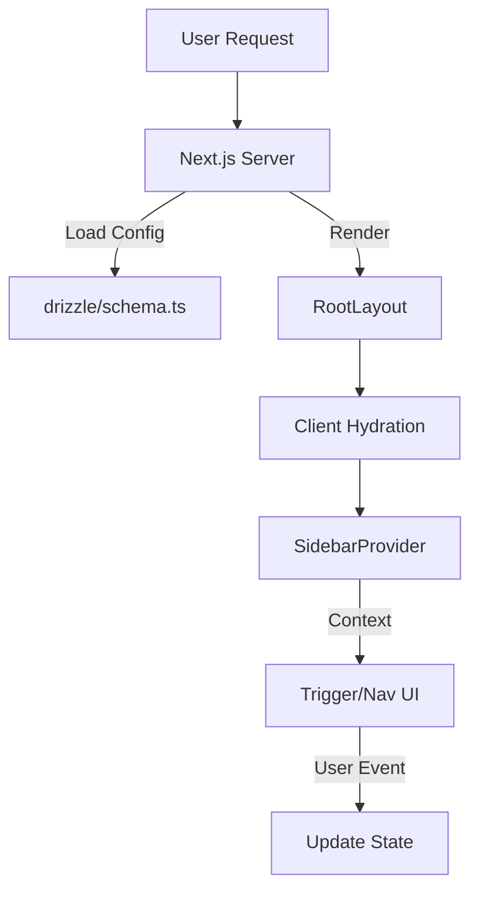

file: docs/data-flow.md
```markdown
# Data Flow & Integrations

This document describes how data moves through the *Máquina de Conteúdo* application, focusing on the Next.js App Router architecture, state management strategies, and integration points.

## Module Dependencies

The project relies on specific configuration definitions drifting down to the application runtime:

- **Type Definitions**: `next-env.d.ts` → `.next` build artifacts.
- **Environment**: `.env` (local) / Vercel Env → `process.env` (accessible in Server Components/Actions).
- **Styles**: `tailwind.config.ts` + `globals.css` → `layout.tsx` → UI Components.

## Service Layer

Currently, the application architecture relies on direct Server Component data access and React Hooks for client state.

| Service | Type | Responsibility |
| :--- | :--- | :--- |
| **React Context** | Client | Manages global UI state (Sidebar visibility, Themes). |
| **Server Actions** | Server | (Intended) Handles form submissions and Agent triggers. |
| **Drizzle ORM** | Data | Type-safe database interactions. |

## High-level Flow

### Application Initialization
1. **Request**: User visits route (e.g., `/styleguide`).
2. **Server**: Next.js renders `RootLayout` (`src/app/layout.tsx`).
3. **Data Fetching**: Static configuration (e.g., Navigation) is loaded server-side or bundled.
4. **Hydration**: Client components (Sidebar, Dialogs) hydrate on the browser.
5. **Interaction**: User toggles UI states (Sidebar) or inputs data.



## Internal Movement

### Navigation Data (`src/app/styleguide/navigation.ts`)
Navigation data is defined strictly in TypeScript files to ensure type safety before rendering.
- **Source**: `navigation.ts` exports `NavSection[]`.
- **Consumer**: Sidebar components consume this structured data to render `SidebarMenu`, `SidebarGroup`, and `SidebarMenuItem`.
- **Type Flow**:
  ```typescript
  // Interfaces defined in navigation.ts
  interface NavItem { title: string; href: string; icon?: LucideIcon }
  interface NavSection { title: string; items: NavItem[] }
  ```

### UI State Management
The application uses React Context and Custom Hooks to manage ephemeral interface state.

1.  **Sidebar State** (`src/components/ui/sidebar.tsx`):
    -   **Context**: `SidebarContext` holds `state` ('expanded' | 'collapsed') and `openMobile` (boolean).
    -   **Persistence**: Uses `document.cookie` (via `SIDEBAR_COOKIE_NAME`) to persist state across reloads.
    -   **Provider**: Wraps the main application logic to expose `toggleSidebar` functionality.

2.  **Responsiveness** (`src/hooks/use-mobile.ts`):
    -   Uses `window.matchMedia` with a breakpoint of `768px`.
    -   Updates internal React state when the window is resized.
    -   **Consumer**: Used by `Sidebar` to automatically collapse on mobile devices.

### Component Props Flow
Data flows strictly downwards via Props in the Shadcn UI ecosystem:
-   `Dialog` (Root) → `DialogTrigger` (Button) & `DialogContent` (Modal).
-   `Sheet` (Root) → `SheetContent` (Off-canvas sidebar).
-   `Form` inputs → Local State or `react-hook-form` (if implemented).

## Integrations

### Database (Drizzle ORM)
-   **Config**: Defined in `drizzle.config.ts` (if present) and `src/db` or `drizzle/` directory.
-   **Schema**: Database tables are defined in TypeScript schemas.
-   **Migration**: Changes are applied via Drizzle Kit.

### AI Agents (Conceptual)
Based on project nomenclature ("Máquina de Conteúdo"):
-   **Input**: User defines topic/parameters via UI.
-   **Process**: Data is sent to a backend Agent (documented in `AGENTS.md`).
-   **Output**: Generated content is stored in DB and streamed back to the UI.

## Observability & Failure Modes

-   **Hydration Errors**: Occur if `useIsMobile` or Sidebar cookies differ between server render and client initial load. Handled by `useEffect` deferred rendering or correct default states.
-   **Sidebar Context**: Throws error if `useSidebar` is used outside of `SidebarProvider`.
```
