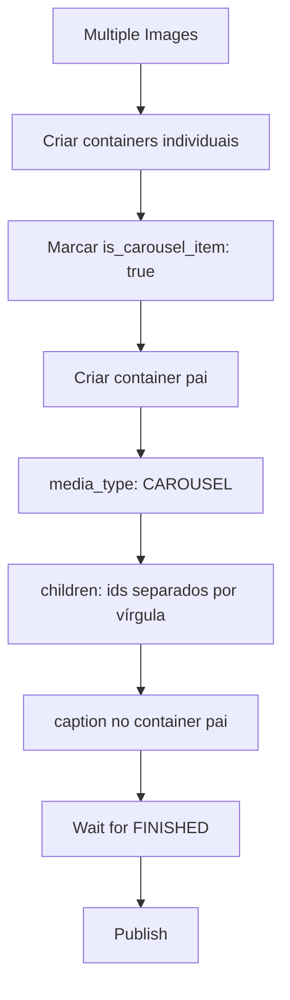

# Instagram Integration - Meta OAuth & Publishing API (Janeiro 2026)

## Contexto

Implementação completa de integração com Instagram Content Publishing API e Facebook Pages, incluindo fluxo OAuth, armazenamento de sessões, e publicação de mídias (imagens e carrosséis).

---

## Insight 1: Next.js Redirect Limitation - Cookie Headers Lost

### Problema

Ao implementar o fluxo OAuth do Meta, os dados temporários eram armazenados em cookies. Porém, após o callback e redirecionamento, o frontend não conseguia recuperar esses dados.

### Causa Raiz

Next.js `NextResponse.redirect()` **não envia headers `Set-Cookie`**. Esta é uma limitação conhecida:

> "When using `NextResponse.redirect()`, the `Set-Cookie` header is not sent to the client."
> — [GitHub Discussion #48434](https://github.com/vercel/next.js/discussions/48434)

**Antes (Quebrado):**
```typescript
// callback/route.ts
const response = NextResponse.redirect(redirectUrl)
response.headers.set("Set-Cookie", `oauth_data=${encodedData}; Path=/; HttpOnly; SameSite=Lax`)
return response
// ❌ Cookie NÃO é definido no navegador
```

### Solução

Substituir cookies por **database session storage** com TTL de 15 minutos:

```typescript
// Criar tabela oauthSessions
await db.insert(oauthSessions).values({
  id: crypto.randomUUID(),
  userId,
  platform: "instagram",
  longLivedToken,
  pagesData: { pages: pagesWithInstagram },
  expiresAt: new Date(Date.now() + 15 * 60 * 1000), // 15 min
})

// Redirect com session_id na URL
const redirectUrl = `/settings?session_id=${sessionId}`
return NextResponse.redirect(redirectUrl)
// ✅ session_id sempre disponível na URL
```

### Arquivos Afetados

- `src/db/schema.ts` - Adicionada tabela `oauthSessions`
- `src/app/api/social/callback/route.ts` - Salva na DB ao invés de cookies
- `src/app/api/social/save-connection/route.ts` - Busca da DB
- `src/app/api/social/oauth-session/route.ts` - Nova rota para buscar sessão
- `src/app/(app)/settings/components/sections/social-section.tsx` - Usa session_id na URL

---

## Insight 2: graph.instagram.com vs graph.facebook.com

### Problema

Erro ao tentar publicar no Instagram:
```json
{
  "error": {
    "message": "Cannot parse access token",
    "type": "OAuthException",
    "code": 190
  }
}
```

### Causa Raiz

O código usava `https://graph.instagram.com` como base URL. Este endpoint tem suporte limitado para Page Access Tokens (formato `EAF...`).

### Solução

Mudar para `https://graph.facebook.com`:

```typescript
// ❌ ERRADO
private readonly baseUrl = "https://graph.instagram.com"
private readonly apiVersion = "v22.0"

// ✅ CORRETO
private readonly baseUrl = "https://graph.facebook.com"
private readonly apiVersion = "v22.0"
```

**Por que funciona?** A Instagram Content Publishing API é acessível via ambos os endpoints, mas `graph.facebook.com`:
- Tem melhor suporte a parse de tokens
- É mais compatível com Page Access Tokens
- É o endpoint documentado para operações de Content Publishing

### Arquivos Afetados

- `src/lib/social/api/instagram.ts` - Mudança de baseUrl

---

## Insight 3: Token em Body vs Query Parameter

### Problema

Erro ao criar container de mídia:
```json
{
  "error": {
    "message": "Invalid parameter",
    "type": "OAuthException",
    "code": 100
  }
}
```

### Causa Raiz

Para requisições POST na Instagram Graph API, o `access_token` deve ser enviado no **corpo JSON** da requisição, não como query parameter.

### Solução

```typescript
// ❌ ERRADO - Query parameter
const url = `${baseUrl}/${apiVersion}/${accountId}/media?access_token=${token}`
const response = await fetch(url, {
  method: "POST",
  headers: { "Content-Type": "application/json" },
  body: JSON.stringify({ image_url, caption }),
})

// ✅ CORRETO - JSON body
const url = `${baseUrl}/${apiVersion}/${accountId}/media`
const response = await fetch(url, {
  method: "POST",
  headers: { "Content-Type": "application/json" },
  body: JSON.stringify({
    image_url: imageUrl,
    caption: caption,
    access_token: token,  // ← No body
  }),
})
```

### Arquivos Afetados

- `src/lib/social/api/instagram.ts` - `createContainer()` e `createCarouselContainer()`

---

## Insight 4: Page Access Token vs User Access Token

### Problema

Erro de permissão ao publicar:
```json
{
  "error": {
    "message": "Invalid OAuth access token - Does not have permission",
    "code": 190
  }
}
```

### Causa Raiz

O código usava User Access Token para publicar, mas a Instagram Content Publishing API requer **Page Access Token**.

### Tipos de Token Meta

| Prefixo | Tipo | Duração | Uso |
|---------|------|----------|-----|
| `EAA` / `EAAB` | User Access Token (Short-lived) | 1-2 horas | Troca inicial OAuth |
| `EAAE` | User Access Token (Long-lived) | 60 dias | Buscar páginas, debug |
| `EAD` | User Access Token (Long-lived - Legacy) | 60 dias | Formato antigo |
| **`EAF`** | **Page Access Token** | **60 dias (efetivamente permanente)** | **Content Publishing API** |

### Solução

```typescript
// ❌ ERRADO - User Access Token
const service = getInstagramService(connection.accessToken, connection.accountId)

// ✅ CORRETO - Page Access Token
const service = getInstagramService(connection.pageAccessToken, connection.accountId)
```

### Armazenamento

A tabela `socialConnections` armazena ambos:
- `accessToken` - User Access Token (para debug e refresh)
- `pageAccessToken` - Page Access Token (usado para publicação)

### Arquivos Afetados

- `src/app/api/social/publish/route.ts` - Seleção de token
- `src/lib/social/types.ts` - Interface SocialConnection

---

## Insight 5: Carousel Publishing Flow

### Problema

Ao publicar um carrossel, apenas a primeira imagem era publicada.

### Causa Raiz

O código detectava corretamente múltiplas imagens, mas não implementava o fluxo específico para carrosséis da Instagram API.

### Fluxo Correto de Carrossel



### Solução

1. Adicionar flag `isCarouselItem` à interface `MediaConfig`
2. Criar containers individuais com `is_carousel_item: true`
3. Criar container pai com `media_type: "CAROUSEL"` e `children`
4. Caption apenas no container pai

```typescript
// 1. Criar containers individuais
const itemContainerIds = await Promise.all(
  carouselItems.map((item) =>
    this.createContainer({
      imageUrl: item.imageUrl,
      isCarouselItem: true,  // ← Flag importante
    })
  )
)

// 2. Criar container pai
containerId = await this.createCarouselContainer(
  itemContainerIds,
  config.caption  // Caption no pai
)
```

### Arquivos Afetados

- `src/lib/social/types.ts` - Adicionado `isCarouselItem` em MediaConfig
- `src/lib/social/api/instagram.ts` - `createCarouselContainer()` e `publishPost()`
- `src/app/api/social/publish/route.ts` - Detecção de carrossel

---

## Padrões Estabelecidos

### 1. Database Session Pattern para OAuth

Sempre preferir banco de dados ao invés de cookies para dados temporários em fluxos OAuth:

```typescript
// 1. Criar sessão com TTL curto (15 min)
const sessionId = crypto.randomUUID()
await db.insert(oauthSessions).values({
  id: sessionId,
  expiresAt: new Date(Date.now() + 15 * 60 * 1000),
  // ... dados
})

// 2. Passar ID via URL (não headers)
redirect(`/settings?session_id=${sessionId}`)

// 3. Validar expiração ao buscar
const session = await db.query.oauthSessions.findOne({ id: sessionId })
if (!session || new Date() > session.expiresAt) {
  return { error: "Session expired" }
}

// 4. Limpar após uso
await db.delete(oauthSessions).where({ id: sessionId })
```

### 2. Meta API Request Pattern

Para requisições POST à Meta Graph API:

```typescript
const url = `${baseUrl}/${apiVersion}/${endpoint}`  // Sem token na URL
const response = await fetch(url, {
  method: "POST",
  headers: { "Content-Type": "application/json" },
  body: JSON.stringify({
    // ... outros campos
    access_token: token,  // Token no body JSON
  }),
})
```

### 3. Token Selection Pattern

```typescript
// Para operações de publishing: SEMPRE Page Access Token
const publishingToken = connection.pageAccessToken || connection.accessToken

// Para operações de leitura/debug: User Access Token
const userToken = connection.accessToken
```

---

## Referências

- [Instagram Content Publishing API](https://developers.facebook.com/docs/instagram-api/reference/ig-user/media)
- [Facebook OAuth Dialog](https://developers.facebook.com/docs/facebook-login/guides/advanced-oauth)
- [Token Reference](https://developers.facebook.com/docs/facebook-login/guides/access-tokens)
- [Next.js Redirect Discussion](https://github.com/vercel/next.js/discussions/48434)

---

*Janeiro 2026*
