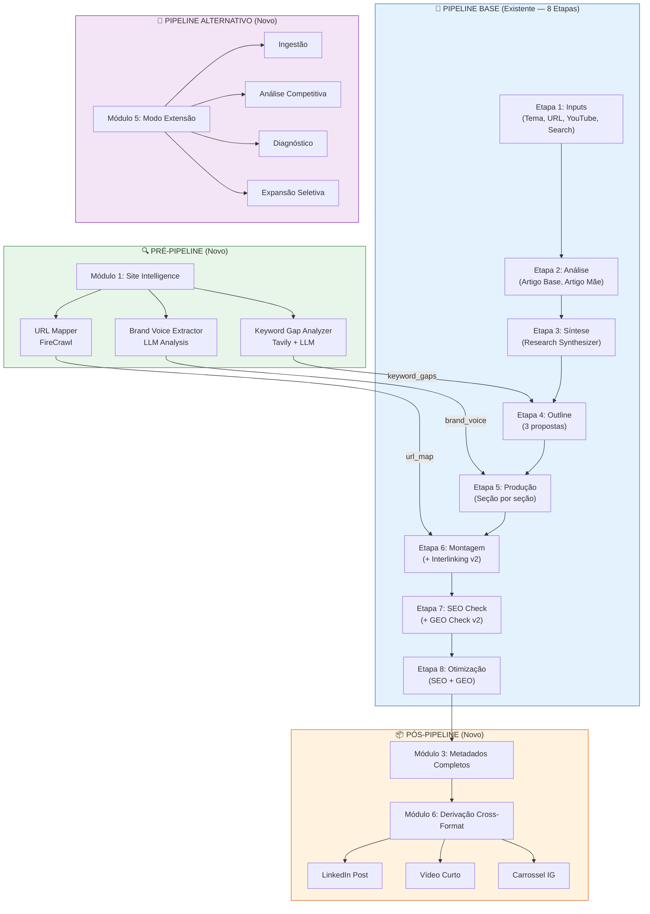
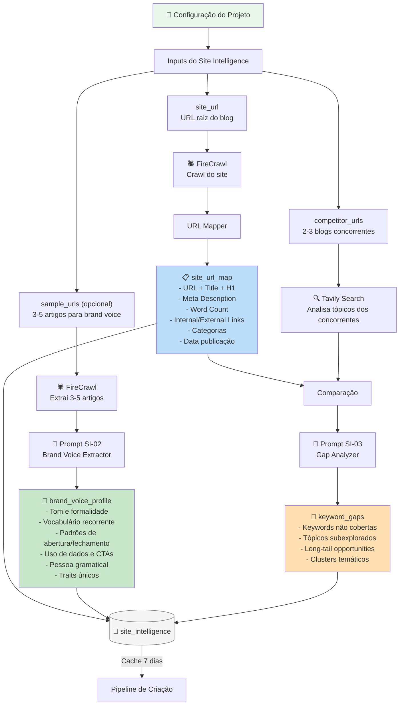
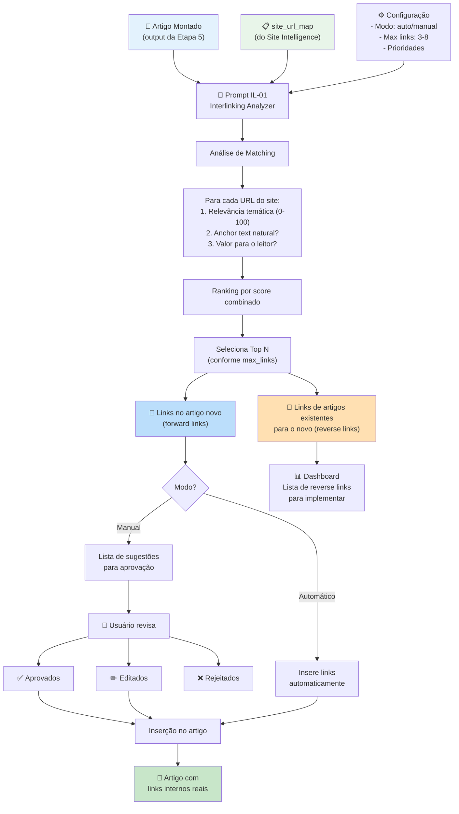
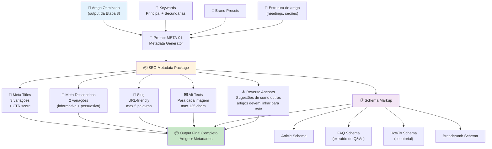
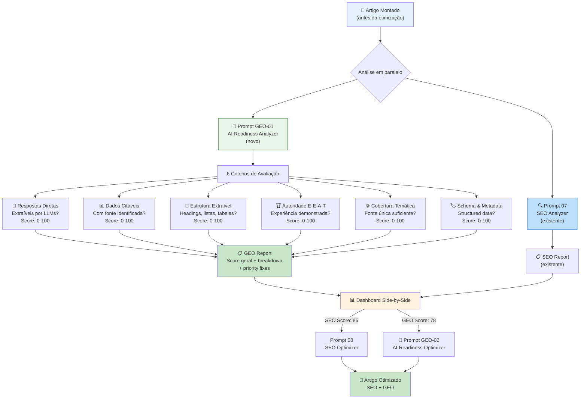
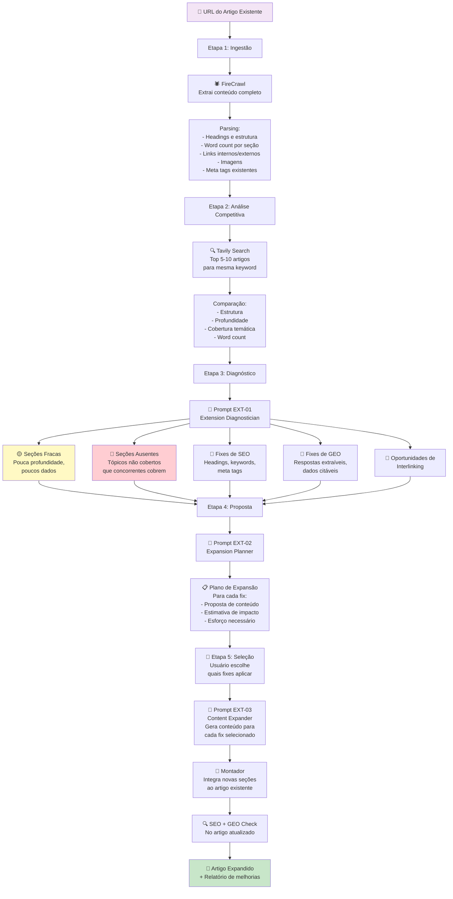
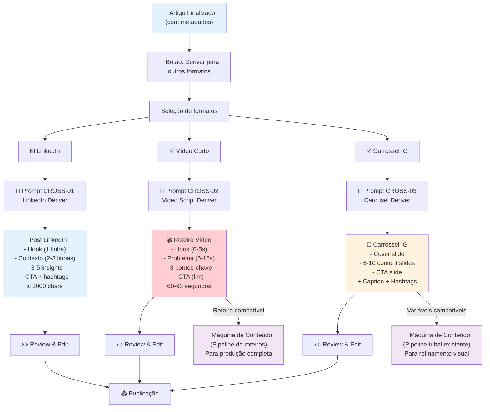
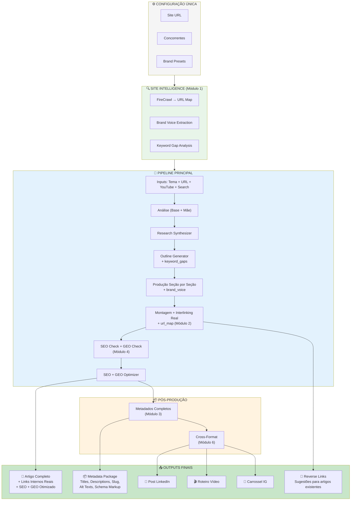
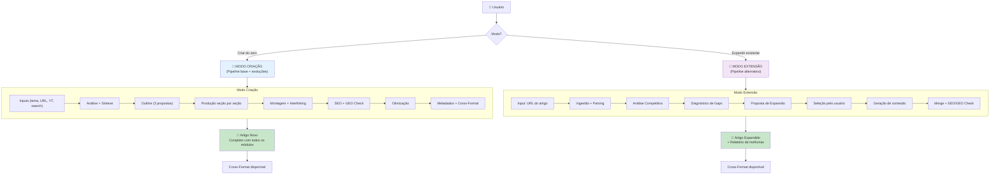

# Article Wizard — Evoluções v2.0
## Diagramas de Fluxo (Mermaid)

**Versão:** 2.0  
**Data:** Fevereiro 2026  
**Total de diagramas:** 10

---

## Diagrama 1 — Visão Geral: Pipeline Base + 6 Módulos de Evolução

---

## Diagrama 2 — Módulo Site Intelligence: Fluxo Completo

---

## Diagrama 3 — Módulo Interlinking Contextual Real

---

## Diagrama 4 — Output de Metadados Completo

---

## Diagrama 5 — Camada GEO: Análise + Otimização

---

## Diagrama 6 — Modo Extensão: Pipeline Completo

---

## Diagrama 7 — Derivação Cross-Format

---

## Diagrama 8 — Pipeline Completo Integrado (Todas as Evoluções)

---

## Diagrama 9 — Modo Extensão vs. Modo Criação

---

## Diagrama 10 — ER: Novas Tabelas + Relações

```mermaid
erDiagram
    projects ||--o{ site_intelligence : "has"
    projects ||--o{ articles : "has"
    articles ||--o{ article_links : "has"
    articles ||--o| article_metadata : "has"
    articles ||--o| article_geo_scores : "has"
    articles ||--o{ article_extensions : "has"
    articles ||--o{ article_derivations : "has"

    projects {
        uuid id PK
        text name
        text site_url
        jsonb brand_presets
        jsonb settings
    }

    site_intelligence {
        uuid id PK
        uuid project_id FK
        text site_url
        jsonb url_map
        jsonb brand_voice_profile
        jsonb keyword_gaps
        text[] competitor_urls
        integer urls_count
        text status
        timestamptz crawled_at
    }

    articles {
        uuid id PK
        uuid project_id FK
        text title
        text content
        text status
        integer seo_score
        integer geo_score
        timestamptz created_at
    }

    article_links {
        uuid id PK
        uuid article_id FK
        text target_url
        text anchor_text
        integer relevance_score
        boolean is_reverse
        text status
        text insertion_point
    }

    article_metadata {
        uuid id PK
        uuid article_id FK
        jsonb meta_titles
        jsonb meta_descriptions
        text slug
        jsonb alt_texts
        jsonb schema_article
        jsonb schema_faq
        jsonb schema_howto
        jsonb reverse_anchors
    }

    article_geo_scores {
        uuid id PK
        uuid article_id FK
        integer overall_score
        integer direct_answers
        integer citable_data
        integer extractable_structure
        integer authority_eeat
        integer topic_coverage
        integer schema_metadata
        jsonb report
        jsonb priority_fixes
    }

    article_extensions {
        uuid id PK
        uuid article_id FK
        text original_url
        jsonb diagnosis
        jsonb selected_fixes
        jsonb generated_content
        text status
        timestamptz applied_at
    }

    article_derivations {
        uuid id PK
        uuid article_id FK
        text format
        jsonb content
        text status
        timestamptz published_at
        text published_url
    }
```

