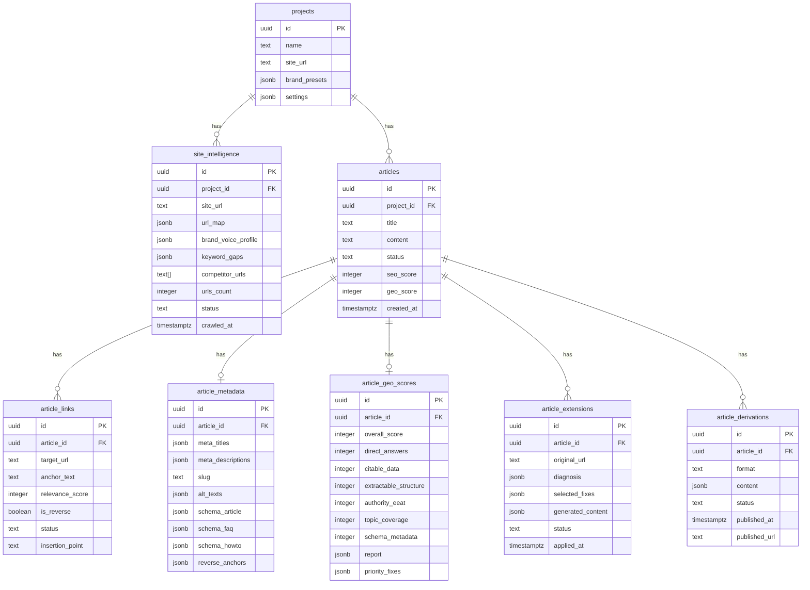

# Article Wizard — Evoluções v2.0
## Diagramas de Fluxo (Mermaid)

**Versão:** 2.0  
**Data:** Fevereiro 2026  
**Total de diagramas:** 10

---

## Diagrama 1 — Visão Geral: Pipeline Base + 6 Módulos de Evolução

```mermaid
flowchart TB
    subgraph PRE["🔍 PRÉ-PIPELINE (Novo)"]
        SI["Módulo 1: Site Intelligence"]
        SI --> SI_A["URL Mapper<br>FireCrawl"]
        SI --> SI_B["Brand Voice Extractor<br>LLM Analysis"]
        SI --> SI_C["Keyword Gap Analyzer<br>Tavily + LLM"]
    end

    subgraph PIPELINE["📝 PIPELINE BASE (Existente — 8 Etapas)"]
        direction TB
        E1["Etapa 1: Inputs<br>(Tema, URL, YouTube, Search)"]
        E2["Etapa 2: Análise<br>(Artigo Base, Artigo Mãe)"]
        E3["Etapa 3: Síntese<br>(Research Synthesizer)"]
        E4["Etapa 4: Outline<br>(3 propostas)"]
        E5["Etapa 5: Produção<br>(Seção por seção)"]
        E6["Etapa 6: Montagem<br>(+ Interlinking v2)"]
        E7["Etapa 7: SEO Check<br>(+ GEO Check v2)"]
        E8["Etapa 8: Otimização<br>(SEO + GEO)"]
    end

    subgraph POST["📦 PÓS-PIPELINE (Novo)"]
        META["Módulo 3: Metadados Completos"]
        CROSS["Módulo 6: Derivação Cross-Format"]
        CROSS --> CROSS_L["LinkedIn Post"]
        CROSS --> CROSS_V["Vídeo Curto"]
        CROSS --> CROSS_C["Carrossel IG"]
    end

    subgraph ALT["🔄 PIPELINE ALTERNATIVO (Novo)"]
        EXT["Módulo 5: Modo Extensão"]
        EXT --> EXT_1["Ingestão"]
        EXT --> EXT_2["Análise Competitiva"]
        EXT --> EXT_3["Diagnóstico"]
        EXT --> EXT_4["Expansão Seletiva"]
    end

    SI_A -->|url_map| E6
    SI_B -->|brand_voice| E5
    SI_C -->|keyword_gaps| E4

    E1 --> E2 --> E3 --> E4 --> E5 --> E6 --> E7 --> E8

    E8 --> META
    META --> CROSS

    style PRE fill:#E8F5E9,stroke:#2E7D32
    style PIPELINE fill:#E3F2FD,stroke:#1565C0
    style POST fill:#FFF3E0,stroke:#E65100
    style ALT fill:#F3E5F5,stroke:#7B1FA2
```

---

## Diagrama 2 — Módulo Site Intelligence: Fluxo Completo

```mermaid
flowchart TB
    START["🏢 Configuração do Projeto"]
    START --> INPUT["Inputs do Site Intelligence"]

    INPUT --> URL["site_url<br>URL raiz do blog"]
    INPUT --> COMP["competitor_urls<br>2-3 blogs concorrentes"]
    INPUT --> SAMPLES["sample_urls (opcional)<br>3-5 artigos para brand voice"]

    URL --> CRAWL["🕷️ FireCrawl<br>Crawl do site"]
    CRAWL --> MAP["URL Mapper"]

    MAP --> MAP_OUT["📋 site_url_map<br>- URL + Title + H1<br>- Meta Description<br>- Word Count<br>- Internal/External Links<br>- Categorias<br>- Data publicação"]

    SAMPLES --> BV_CRAWL["🕷️ FireCrawl<br>Extrai 3-5 artigos"]
    BV_CRAWL --> BV_PROMPT["🤖 Prompt SI-02<br>Brand Voice Extractor"]
    BV_PROMPT --> BV_OUT["🎨 brand_voice_profile<br>- Tom e formalidade<br>- Vocabulário recorrente<br>- Padrões de abertura/fechamento<br>- Uso de dados e CTAs<br>- Pessoa gramatical<br>- Traits únicos"]

    COMP --> GAP_TAVILY["🔍 Tavily Search<br>Analisa tópicos dos concorrentes"]
    MAP_OUT --> GAP_COMPARE["Comparação"]
    GAP_TAVILY --> GAP_COMPARE
    GAP_COMPARE --> GAP_PROMPT["🤖 Prompt SI-03<br>Gap Analyzer"]
    GAP_PROMPT --> GAP_OUT["🎯 keyword_gaps<br>- Keywords não cobertas<br>- Tópicos subexplorados<br>- Long-tail opportunities<br>- Clusters temáticos"]

    MAP_OUT --> DB[(💾 site_intelligence)]
    BV_OUT --> DB
    GAP_OUT --> DB

    DB -->|Cache 7 dias| PIPELINE["Pipeline de Criação"]

    style START fill:#E8F5E9
    style MAP_OUT fill:#BBDEFB
    style BV_OUT fill:#C8E6C9
    style GAP_OUT fill:#FFE0B2
    style DB fill:#F5F5F5,stroke:#757575
```

---

## Diagrama 3 — Módulo Interlinking Contextual Real

```mermaid
flowchart TB
    ARTICLE["📄 Artigo Montado<br>(output da Etapa 5)"]
    URLS["📋 site_url_map<br>(do Site Intelligence)"]
    CONFIG["⚙️ Configuração<br>- Modo: auto/manual<br>- Max links: 3-8<br>- Prioridades"]

    ARTICLE --> PROMPT["🤖 Prompt IL-01<br>Interlinking Analyzer"]
    URLS --> PROMPT
    CONFIG --> PROMPT

    PROMPT --> ANALYSIS["Análise de Matching"]

    ANALYSIS --> SCORE["Para cada URL do site:<br>1. Relevância temática (0-100)<br>2. Anchor text natural?<br>3. Valor para o leitor?"]

    SCORE --> RANK["Ranking por score combinado"]
    RANK --> SELECT["Seleciona Top N<br>(conforme max_links)"]

    SELECT --> FORWARD["🔗 Links no artigo novo<br>(forward links)"]
    SELECT --> REVERSE["🔗 Links de artigos existentes<br>para o novo (reverse links)"]

    FORWARD --> MODE{Modo?}

    MODE -->|Automático| AUTO["Insere links<br>automaticamente"]
    MODE -->|Manual| MANUAL["Lista de sugestões<br>para aprovação"]

    MANUAL --> REVIEW["👤 Usuário revisa"]
    REVIEW --> APPROVE["✅ Aprovados"]
    REVIEW --> REJECT["❌ Rejeitados"]
    REVIEW --> EDIT["✏️ Editados"]

    APPROVE --> INSERT["Inserção no artigo"]
    EDIT --> INSERT
    AUTO --> INSERT

    REVERSE --> DASHBOARD["📊 Dashboard<br>Lista de reverse links<br>para implementar"]

    INSERT --> FINAL["📄 Artigo com<br>links internos reais"]

    style ARTICLE fill:#E3F2FD
    style URLS fill:#E8F5E9
    style FORWARD fill:#BBDEFB
    style REVERSE fill:#FFE0B2
    style FINAL fill:#C8E6C9
```

---

## Diagrama 4 — Output de Metadados Completo

```mermaid
flowchart TB
    ARTICLE["📄 Artigo Otimizado<br>(output da Etapa 8)"]
    KW["🔑 Keywords<br>Principal + Secundárias"]
    BRAND["🎨 Brand Presets"]
    STRUCT["📐 Estrutura do artigo<br>(headings, seções)"]

    ARTICLE --> META_PROMPT["🤖 Prompt META-01<br>Metadata Generator"]
    KW --> META_PROMPT
    BRAND --> META_PROMPT
    STRUCT --> META_PROMPT

    META_PROMPT --> OUTPUT["📦 SEO Metadata Package"]

    OUTPUT --> TITLES["📝 Meta Titles<br>3 variações<br>+ CTR score"]
    OUTPUT --> DESCS["📝 Meta Descriptions<br>2 variações<br>(informativa + persuasiva)"]
    OUTPUT --> SLUG["🔗 Slug<br>URL-friendly<br>max 5 palavras"]
    OUTPUT --> ALTS["🖼️ Alt Texts<br>Para cada imagem<br>max 125 chars"]
    OUTPUT --> SCHEMA["📋 Schema Markup"]
    OUTPUT --> ANCHORS["⚓ Reverse Anchors<br>Sugestões de como outros<br>artigos devem linkar para este"]

    SCHEMA --> S_ARTICLE["Article Schema"]
    SCHEMA --> S_FAQ["FAQ Schema<br>(extraído de Q&As)"]
    SCHEMA --> S_HOWTO["HowTo Schema<br>(se tutorial)"]
    SCHEMA --> S_BREAD["Breadcrumb Schema"]

    TITLES --> FINAL["📦 Output Final Completo<br>Artigo + Metadados"]
    DESCS --> FINAL
    SLUG --> FINAL
    ALTS --> FINAL
    SCHEMA --> FINAL
    ANCHORS --> FINAL

    style ARTICLE fill:#E3F2FD
    style OUTPUT fill:#FFF3E0
    style FINAL fill:#C8E6C9
    style SCHEMA fill:#F3E5F5
```

---

## Diagrama 5 — Camada GEO: Análise + Otimização

```mermaid
flowchart TB
    ARTICLE["📄 Artigo Montado<br>(antes da otimização)"]

    ARTICLE --> PARALLEL{Análise em paralelo}

    PARALLEL --> SEO_CHECK["🔍 Prompt 07<br>SEO Analyzer<br>(existente)"]
    PARALLEL --> GEO_CHECK["🤖 Prompt GEO-01<br>AI-Readiness Analyzer<br>(novo)"]

    GEO_CHECK --> CRITERIA["6 Critérios de Avaliação"]

    CRITERIA --> C1["📌 Respostas Diretas<br>Extraíveis por LLMs?<br>Score: 0-100"]
    CRITERIA --> C2["📊 Dados Citáveis<br>Com fonte identificada?<br>Score: 0-100"]
    CRITERIA --> C3["📐 Estrutura Extraível<br>Headings, listas, tabelas?<br>Score: 0-100"]
    CRITERIA --> C4["🏆 Autoridade E-E-A-T<br>Experiência demonstrada?<br>Score: 0-100"]
    CRITERIA --> C5["🌐 Cobertura Temática<br>Fonte única suficiente?<br>Score: 0-100"]
    CRITERIA --> C6["🏷️ Schema & Metadata<br>Structured data?<br>Score: 0-100"]

    C1 --> GEO_REPORT["📋 GEO Report<br>Score geral + breakdown<br>+ priority fixes"]
    C2 --> GEO_REPORT
    C3 --> GEO_REPORT
    C4 --> GEO_REPORT
    C5 --> GEO_REPORT
    C6 --> GEO_REPORT

    SEO_CHECK --> SEO_REPORT["📋 SEO Report<br>(existente)"]

    GEO_REPORT --> DASHBOARD["📊 Dashboard Side-by-Side"]
    SEO_REPORT --> DASHBOARD

    DASHBOARD --> |SEO Score: 85| OPT_SEO["Prompt 08<br>SEO Optimizer"]
    DASHBOARD --> |GEO Score: 78| OPT_GEO["🤖 Prompt GEO-02<br>AI-Readiness Optimizer"]

    OPT_SEO --> FINAL["📄 Artigo Otimizado<br>SEO + GEO"]
    OPT_GEO --> FINAL

    style ARTICLE fill:#E3F2FD
    style GEO_CHECK fill:#E8F5E9,stroke:#2E7D32
    style SEO_CHECK fill:#BBDEFB,stroke:#1565C0
    style GEO_REPORT fill:#C8E6C9
    style DASHBOARD fill:#FFF3E0
    style FINAL fill:#C8E6C9
```

---

## Diagrama 6 — Modo Extensão: Pipeline Completo

```mermaid
flowchart TB
    START["🔗 URL do Artigo Existente"]

    START --> INGEST["Etapa 1: Ingestão"]
    INGEST --> FC["🕷️ FireCrawl<br>Extrai conteúdo completo"]
    FC --> PARSE["Parsing:<br>- Headings e estrutura<br>- Word count por seção<br>- Links internos/externos<br>- Imagens<br>- Meta tags existentes"]

    PARSE --> COMPETE["Etapa 2: Análise Competitiva"]
    COMPETE --> TAVILY["🔍 Tavily Search<br>Top 5-10 artigos<br>para mesma keyword"]
    TAVILY --> COMPARE["Comparação:<br>- Estrutura<br>- Profundidade<br>- Cobertura temática<br>- Word count"]

    COMPARE --> DIAG["Etapa 3: Diagnóstico"]
    DIAG --> EXT_PROMPT["🤖 Prompt EXT-01<br>Extension Diagnostician"]

    EXT_PROMPT --> WEAK["🟡 Seções Fracas<br>Pouca profundidade,<br>poucos dados"]
    EXT_PROMPT --> MISSING["🔴 Seções Ausentes<br>Tópicos não cobertos<br>que concorrentes cobrem"]
    EXT_PROMPT --> SEO_FIX["🔧 Fixes de SEO<br>Headings, keywords,<br>meta tags"]
    EXT_PROMPT --> GEO_FIX["🔧 Fixes de GEO<br>Respostas extraíveis,<br>dados citáveis"]
    EXT_PROMPT --> LINK_OPP["🔗 Oportunidades de<br>Interlinking"]

    WEAK --> PROPOSAL["Etapa 4: Proposta"]
    MISSING --> PROPOSAL
    SEO_FIX --> PROPOSAL
    GEO_FIX --> PROPOSAL
    LINK_OPP --> PROPOSAL

    PROPOSAL --> EXT_PROMPT2["🤖 Prompt EXT-02<br>Expansion Planner"]

    EXT_PROMPT2 --> PLAN["📋 Plano de Expansão<br>Para cada fix:<br>- Proposta de conteúdo<br>- Estimativa de impacto<br>- Esforço necessário"]

    PLAN --> SELECT["👤 Etapa 5: Seleção<br>Usuário escolhe<br>quais fixes aplicar"]

    SELECT --> GEN["🤖 Prompt EXT-03<br>Content Expander<br>Gera conteúdo para<br>cada fix selecionado"]

    GEN --> MERGE["🔧 Montador<br>Integra novas seções<br>ao artigo existente"]

    MERGE --> RECHECK["🔍 SEO + GEO Check<br>No artigo atualizado"]

    RECHECK --> FINAL["📄 Artigo Expandido<br>+ Relatório de melhorias"]

    style START fill:#F3E5F5
    style WEAK fill:#FFF9C4
    style MISSING fill:#FFCDD2
    style FINAL fill:#C8E6C9
```

---

## Diagrama 7 — Derivação Cross-Format

```mermaid
flowchart TB
    ARTICLE["📄 Artigo Finalizado<br>(com metadados)"]

    ARTICLE --> TRIGGER["🔘 Botão: Derivar para<br>outros formatos"]

    TRIGGER --> SELECT["Seleção de formatos"]

    SELECT --> LI["☑️ LinkedIn"]
    SELECT --> VD["☑️ Vídeo Curto"]
    SELECT --> CR["☑️ Carrossel IG"]

    LI --> P_LI["🤖 Prompt CROSS-01<br>LinkedIn Deriver"]
    VD --> P_VD["🤖 Prompt CROSS-02<br>Video Script Deriver"]
    CR --> P_CR["🤖 Prompt CROSS-03<br>Carousel Deriver"]

    P_LI --> O_LI["📱 Post LinkedIn<br>- Hook (1 linha)<br>- Contexto (2-3 linhas)<br>- 3-5 insights<br>- CTA + hashtags<br>≤ 3000 chars"]

    P_VD --> O_VD["🎬 Roteiro Vídeo<br>- Hook (0-5s)<br>- Problema (5-15s)<br>- 3 pontos-chave<br>- CTA (fim)<br>60-90 segundos"]

    P_CR --> O_CR["📸 Carrossel IG<br>- Cover slide<br>- 6-10 content slides<br>- CTA slide<br>+ Caption + Hashtags"]

    O_LI --> EDIT_LI["✏️ Review & Edit"]
    O_VD --> EDIT_VD["✏️ Review & Edit"]
    O_CR --> EDIT_CR["✏️ Review & Edit"]

    O_CR -.->|Variáveis compatíveis| MC["🔄 Máquina de Conteúdo<br>(Pipeline tribal existente)<br>Para refinamento visual"]

    O_VD -.->|Roteiro compatível| MC_V["🔄 Máquina de Conteúdo<br>(Pipeline de roteiros)<br>Para produção completa"]

    EDIT_LI --> PUB["📤 Publicação"]
    EDIT_VD --> PUB
    EDIT_CR --> PUB

    style ARTICLE fill:#E3F2FD
    style O_LI fill:#E3F2FD
    style O_VD fill:#FFCDD2
    style O_CR fill:#FFF3E0
    style MC fill:#F3E5F5
    style MC_V fill:#F3E5F5
```

---

## Diagrama 8 — Pipeline Completo Integrado (Todas as Evoluções)

```mermaid
flowchart TB
    subgraph CONFIG["⚙️ CONFIGURAÇÃO ÚNICA"]
        SITE_URL["Site URL"]
        COMPETITORS["Concorrentes"]
        BRAND["Brand Presets"]
    end

    subgraph SI["🔍 SITE INTELLIGENCE (Módulo 1)"]
        SI_CRAWL["FireCrawl → URL Map"]
        SI_VOICE["Brand Voice Extraction"]
        SI_GAPS["Keyword Gap Analysis"]
    end

    CONFIG --> SI

    subgraph MAIN["📝 PIPELINE PRINCIPAL"]
        direction TB
        INPUT["Inputs: Tema + URL + YouTube + Search"]
        ANALYZE["Análise (Base + Mãe)"]
        SYNTH["Research Synthesizer"]
        OUTLINE["Outline Generator<br>+ keyword_gaps"]
        PRODUCE["Produção Seção por Seção<br>+ brand_voice"]
        MOUNT["Montagem + Interlinking Real<br>+ url_map (Módulo 2)"]
        CHECK["SEO Check + GEO Check<br>(Módulo 4)"]
        OPTIMIZE["SEO + GEO Optimizer"]
    end

    SI --> MAIN
    INPUT --> ANALYZE --> SYNTH --> OUTLINE --> PRODUCE --> MOUNT --> CHECK --> OPTIMIZE

    subgraph POST["📦 PÓS-PRODUÇÃO"]
        META["Metadados Completos<br>(Módulo 3)"]
        CROSS["Cross-Format<br>(Módulo 6)"]
    end

    OPTIMIZE --> META --> CROSS

    subgraph OUTPUT["📤 OUTPUTS FINAIS"]
        ART["📄 Artigo Completo<br>+ Links Internos Reais<br>+ SEO + GEO Otimizado"]
        META_PKG["📦 Metadata Package<br>Titles, Descriptions, Slug,<br>Alt Texts, Schema Markup"]
        LI_POST["📱 Post LinkedIn"]
        VD_SCRIPT["🎬 Roteiro Vídeo"]
        CR_SLIDES["📸 Carrossel IG"]
        REV_LINKS["🔗 Reverse Links<br>Sugestões para artigos existentes"]
    end

    CROSS --> LI_POST
    CROSS --> VD_SCRIPT
    CROSS --> CR_SLIDES
    META --> META_PKG
    MOUNT --> REV_LINKS
    OPTIMIZE --> ART

    style CONFIG fill:#F5F5F5
    style SI fill:#E8F5E9
    style MAIN fill:#E3F2FD
    style POST fill:#FFF3E0
    style OUTPUT fill:#C8E6C9
```

---

## Diagrama 9 — Modo Extensão vs. Modo Criação

```mermaid
flowchart TB
    USER["👤 Usuário"]
    USER --> CHOICE{Modo?}

    CHOICE -->|Criar do zero| CREATE["📝 MODO CRIAÇÃO<br>(Pipeline base + evoluções)"]
    CHOICE -->|Expandir existente| EXTEND["🔄 MODO EXTENSÃO<br>(Pipeline alternativo)"]

    subgraph CREATE_FLOW["Modo Criação"]
        C1["Inputs (tema, URL, YT, search)"]
        C2["Análise + Síntese"]
        C3["Outline (3 propostas)"]
        C4["Produção seção por seção"]
        C5["Montagem + Interlinking"]
        C6["SEO + GEO Check"]
        C7["Otimização"]
        C8["Metadados + Cross-Format"]
        C1 --> C2 --> C3 --> C4 --> C5 --> C6 --> C7 --> C8
    end

    subgraph EXTEND_FLOW["Modo Extensão"]
        E1["Input: URL do artigo"]
        E2["Ingestão + Parsing"]
        E3["Análise Competitiva"]
        E4["Diagnóstico de Gaps"]
        E5["Proposta de Expansão"]
        E6["Seleção pelo usuário"]
        E7["Geração de conteúdo"]
        E8["Merge + SEO/GEO Check"]
        E1 --> E2 --> E3 --> E4 --> E5 --> E6 --> E7 --> E8
    end

    CREATE --> CREATE_FLOW
    EXTEND --> EXTEND_FLOW

    CREATE_FLOW --> RESULT_C["📄 Artigo Novo<br>Completo com todos os módulos"]
    EXTEND_FLOW --> RESULT_E["📄 Artigo Expandido<br>+ Relatório de melhorias"]

    RESULT_C --> CROSS_C["Cross-Format disponível"]
    RESULT_E --> CROSS_E["Cross-Format disponível"]

    style CREATE fill:#E3F2FD
    style EXTEND fill:#F3E5F5
    style RESULT_C fill:#C8E6C9
    style RESULT_E fill:#C8E6C9
```

---

## Diagrama 10 — ER: Novas Tabelas + Relações

